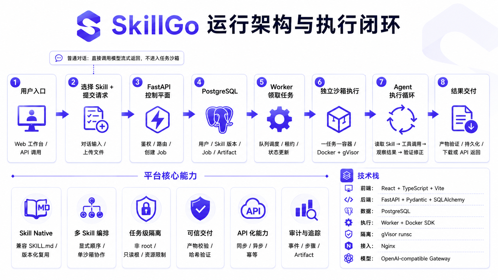

<p align="center">
  
</p>

<h1 align="center">SkillGo</h1>

<p align="center">
  让 Skill 变成每个人的能力。<br />
  <sub>A self-hosted, multi-user Skill platform with isolated per-task sandbox execution.</sub>
</p>

<p align="center">
  
  
  
  
</p>

<p align="center">
  <a href="#平台定位">平台定位</a> ·
  <a href="#核心能力">核心能力</a> ·
  <a href="#不同用户与任务如何隔离">隔离与执行</a> ·
  <a href="#把-skill-封装为-api">Skill API</a> ·
  <a href="#快速开始">快速开始</a> ·
  <a href="docs/README.md">项目文档</a> ·
  <a href="CONTRIBUTING.md">参与贡献</a> ·
  <a href="SECURITY.md">安全政策</a>
</p>

SkillGo 是一个可私有化部署的多用户 Skill 运行平台。它不止用于上传、管理和发布 Skill，更聚焦于让 Skill 在独立任务沙箱中真实执行：不同用户彼此隔离，同一用户并发运行的不同任务也不会共享文件系统、进程状态和临时环境。

Skill 的上传、版本、审核和权限属于治理入口；**让需要工具、脚本和文件处理的 Skill 在任务级独立沙箱中运行**，才是 SkillGo 的执行核心。已经验证并发布的 Skill 还可以固定版本后封装为 API，继续沿用相同的任务归属、沙箱隔离和产物验证机制。

平台围绕三个核心问题设计：

1. **Skill 怎样在真实环境中独立运行**：每个沙箱任务的每次执行尝试都会创建独立的一次性容器和 Docker Volume，并拥有自己的工作区、进程和资源限制。
2. **多人使用时怎样保证互不干扰**：用户资源先按所有权隔离，运行时再按任务隔离；同一实例内的用户、任务、附件、进程和产物不会混用。
3. **已经验证的 Skill 怎样接入其他系统**：已发布的 Skill 版本可以部署成带独立 API Key 的 Endpoint，供业务系统同步调用或异步提交文件任务。

> 当前项目处于积极开发阶段。核心流程已有自动化测试覆盖，但在用于生产或处理敏感数据前，仍应完成组织级租户、数据库迁移、密钥托管、TLS、限流和独立执行控制面等加固。

## 平台定位

SkillGo 不是单纯的 Skill 仓库，也不是只生成文本答案的聊天界面。它把一个 Skill 从“可上传的说明和脚本”推进为“可治理、可执行、可验证、可接入业务”的运行单元。

| 层次 | SkillGo 负责什么 |
| --- | --- |
| Skill 治理 | 上传、结构校验、不可变版本、权限声明、审核、发布和可见性。 |
| 多用户边界 | 账号、角色、资源所有权、附件路径、任务归属和管理审计。 |
| 隔离执行 | 每次沙箱执行创建一次性 Volume 与容器；只装入当前任务需要的 Skill 和输入文件。 |
| 结果交付 | 记录执行过程，只接收 `/workspace/output` 中的真实文件，并校验大小、哈希和结构。 |
| 业务接入 | 将已发布的固定 Skill 版本部署为带独立密钥的同步或异步 API Endpoint。 |

这里的“独立环境”不是为每个用户长期保留一台虚拟机，而是采用更细的**任务级、执行尝试级隔离**：一次运行只看到自己的 `/workspace`，结束、取消或超时后回收本次容器和临时 Volume。不同任务可以使用同一份受控沙箱基础镜像，但不会共享可写工作区或进程状态。

### 运行架构与执行闭环

<p align="center">
  
</p>

<p align="center"><sub>普通对话直接调用模型；需要工具、脚本或文件处理的 Skill 任务进入独立沙箱执行链路。</sub></p>

## 核心能力

### 每个沙箱任务独立运行

- 需要工具、脚本或文件处理的网页任务，以及异步 API 发起的工作流任务，都进入同一套隔离执行链路。
- 每次执行尝试拥有独立的 Docker Volume、容器、可写工作区、`/tmp` 和资源预算。
- Worker 只装入本次任务选定的不可变 Skill 版本与输入文件，不把平台完整存储目录暴露给任务容器。
- Linux 部署可通过 Docker 的 `runtime=runsc` 使用 gVisor；缺少配置的 Runtime 时明确报告不可用，不静默降级。
- 任务产物必须真实写入 `/workspace/output` 并通过持久化校验，模型仅在回复中声称“已完成”不算成功。

更完整的执行边界见 [不同用户与任务如何隔离](#不同用户与任务如何隔离)和 [gVisor 是如何应用的](#gvisor-是如何应用的)。普通对话和 `instruction_only` 同步调用不创建任务容器；它们仍受用户归属、权限和数据访问边界约束。

### 多用户管理

- **成员**注册后立即启用，可以使用工作台、创建 Skill、上传附件并运行有权限的版本。
- **管理员**注册后进入待审核状态，只有超级管理员批准后才能登录；启用后可以处理 Skill 审核和普通用户管理。
- **超级管理员**由部署时的 Bootstrap 账号确定，每个实例严格保留一个，公开角色接口不能再授予第二个超级管理员。
- 密码使用 Argon2 哈希，网页会话使用带签发方、受众和过期时间的 JWT；管理操作、登录、审核、Endpoint 和文件操作写入审计记录。
- 用户、会话、Skill、任务、附件、Endpoint 和产物在数据模型中都保存明确的所有者字段，API 查询同时校验当前用户和对象归属，而不是只依赖前端隐藏菜单。

当前的“多用户”指同一个私有化实例内的账号、角色和资源隔离；组织、团队空间、SSO 和组织级租户仍在规划中。

### Skill 生命周期

- 兼容以顶层 `SKILL.md` 为入口的通用 Agent Skill，并支持可选的 `skillgo.yaml` 扩展。
- Skill 包经过结构与路径检查后保存为版本；版本可提交审核、批准并发布，只有已发布且当前运行环境可执行的版本才能部署为 Endpoint。
- 平台根据 `SKILL.md`、Manifest、脚本、依赖文件、所需命令和文档产物识别运行画像，将版本划分为 `instruction_only`、`sandbox_required` 或等待平台工具接入。
- 支持在一个任务中按用户明确指定的顺序挂载多个 Skill 版本，它们共享该任务的临时工作区，但不与其他任务共享。
- 模型服务通过 OpenAI-compatible 接口接入；Skill 的版本、会话、任务、工具事件和产物由 SkillGo 管理，不绑定单一模型供应商。

### 沙箱生命周期与回收

SkillGo 的运行隔离粒度不是“一个用户永久占用一个容器”，而是更严格的“一个任务执行尝试一套沙箱”：

```text
用户 A ──► 任务 A1 ──► Volume A1 + runsc 容器 A1 ──► 回收
       └─► 任务 A2 ──► Volume A2 + runsc 容器 A2 ──► 回收

用户 B ──► 任务 B1 ──► Volume B1 + runsc 容器 B1 ──► 回收
```

容器名称、Volume 和标签同时包含 `job_id` 与本次执行的 `execution_id`。任务结束、取消、超时或租约失效后，只清理该次执行拥有的容器和 Volume，不会触碰另一个用户或同一用户的新执行尝试。

### 可验证的任务与产物

- `WorkflowJob` 保存任务状态、所选 Skill 版本、输入文件、步骤和面向用户的事件时间线。
- `AgentRun` 保存执行尝试、Worker 租约、心跳、重试次数和最终摘要；短期详细事件可以按保留策略清理，任务结论和产物不会随之消失。
- 最终文件必须位于 `/workspace/output`，Worker 才允许从沙箱取回。
- 取回后的产物记录大小、SHA-256、存储位置和验证状态；平台重新读取持久化文件，核对大小、哈希和文件结构后才把任务标记为成功。
- 模型声称“已经生成文件”并不足以完成任务，必须存在真实文件和通过验证的产物记录。

## 不同用户与任务如何隔离

SkillGo 使用多层边界共同实现隔离，而不是只依赖容器名称：

| 层级 | 实际实现 |
| --- | --- |
| 数据库访问 | 用户资源保存 `user_id` 或 `owner_id`；会话、文件、任务、Endpoint 和产物接口在 SQL 查询中同时匹配当前用户。多数对象在无权访问时按不存在处理，避免枚举其他用户资源。 |
| 持久化文件 | 会话附件使用 `workspaces/{user_id}/{conversation_id}/...`，任务输入使用 `job-inputs/{user_id}/{job_id}/...`，任务产物使用 `job-artifacts/{user_id}/{job_id}/...`。路径在存储根目录内再次做越界检查。 |
| 执行工作区 | Worker 只把当前任务绑定的 Skill 包和输入文件复制进本次独立 Volume；实际任务容器只挂载这一个 Volume 到 `/workspace`，不会挂载平台完整存储目录。 |
| 进程与资源 | 每次执行创建独立容器，使用非 root 用户 `10001:10001`、只读根文件系统、独立 `/tmp`、进程/内存/CPU 上限、`cap_drop=ALL` 和 `no-new-privileges`。 |
| 调度一致性 | Worker 通过数据库行锁领取任务，为 `AgentRun` 写入随机 `lease_token`、Worker 身份和过期时间，并持续心跳；失去租约的旧 Worker 不能提交结果或覆盖新的执行尝试。 |

任务沙箱不会获得 Docker Socket、数据库连接、平台 JWT Secret、用户登录信息或模型 API Key。Docker Socket 和模型连接只存在于受信任的 Worker；Worker 负责模型编排，并把经过约束的文件与命令操作发送到当前任务容器。

## gVisor 是如何应用的

SkillGo 没有把 gVisor 当成一个独立的远程服务。Linux 宿主机安装并向 Docker 注册 `runsc` 后，Worker 在创建实际任务容器时将 `SKILLGO_SANDBOX_RUNTIME` 作为 Docker 的 `runtime` 参数传入，默认值就是 `runsc`：

```text
Sandbox Worker
  └─ Docker SDK: containers.create(runtime="runsc", ...)
       └─ Docker
            └─ gVisor runsc
                 └─ Skill 任务进程
```

具体执行过程如下：

1. API 创建带 `user_id`、固定 Skill 版本和输入文件的 `WorkflowJob`。
2. Worker 通过租约领取任务，创建仅属于本次 `execution_id` 的 Docker Volume。
3. 一个默认断网、能力受限的临时 Stager 只负责把选中的 Skill 包和输入文件放入 Volume，并把文件所有权调整为任务用户。
4. Worker 创建真正执行 Skill 的非 root 容器，并设置 `runtime=runsc`。gVisor 位于容器进程与宿主 Linux 内核之间，实际 Skill 代码不会直接使用普通 Docker 容器的宿主系统调用路径。
5. 容器根文件系统只读，唯一持久可写位置是该任务的 `/workspace`；临时依赖也只能安装到这个工作区，任务结束后一起删除。
6. 任务默认使用 `network_mode=none`。当运行画像识别到 Skill 明确需要联网或下载依赖时，当前实现会为该任务启用 Docker bridge 网络；这是任务级开关，尚不是域名级出口代理或精细白名单。
7. Worker 只收集 `/workspace/output` 下声明的常规文件，完成持久化与完整性校验后销毁容器和 Volume。

启动时 Worker 会检查 Docker 是否真的注册了配置的 Runtime，并检查沙箱镜像是否存在；缺少 `runsc` 或镜像时会明确报告运行环境不可用，而不是悄悄退回普通执行路径。核心实现见 [`sandbox_runtime.py`](backend/app/sandbox_runtime.py) 与 [`sandbox_worker.py`](backend/app/sandbox_worker.py)。

## 把 Skill 封装为 API

SkillGo 可以把已经审核发布的 Skill 版本固定为 Endpoint，从网页之外稳定调用。Endpoint 保存所有者、Skill、不可变版本、唯一 slug、启停状态和独立访问密钥。

创建或轮换 Endpoint 时，完整 API Key 只返回一次；数据库只保存前缀和 SHA-256 摘要，后续使用常量时间比较验证 `X-SkillGo-Key`。

平台根据 Skill 的执行画像提供两条调用路径：

| Skill 类型 | 调用方式 | 行为 |
| --- | --- | --- |
| `instruction_only` | `POST /api/v1/invoke/{slug}` | 同步 JSON 输入；校验输入 Schema，执行固定版本并返回结构化输出与 `run_id`。 |
| `sandbox_required` | `POST /api/v1/workflow-endpoints/{slug}/jobs` | 异步文件任务；返回 `202 Accepted` 和任务地址，可查询状态、取消任务并下载已验证产物。 |

异步 Endpoint 支持 `Idempotency-Key`。同一 Endpoint 重复提交同一个键时返回原任务，不会重复创建；`WorkflowEndpointRequest` 把外部请求持久化绑定到确切的 Endpoint 和任务，另一个 Endpoint 即使属于同一用户、使用同一 Skill 版本，也不能读取这次任务和产物。

外部 API 创建的任务并不会绕过多用户体系：任务归属 Endpoint 所有者，输入和产物继续写入该用户与任务的隔离路径，Worker 仍然为它创建一次性 gVisor 沙箱。完整调用契约见 [工作流 API 文档](docs/workflow-api.md) 和 [Python 示例](examples/workflow_api_client.py)。

## 当前状态

| 模块 | 状态 |
| --- | --- |
| 每次任务独立 Docker Volume 与容器 | 可用 |
| Linux + gVisor `runsc` 隔离 | 可用，需宿主机安装并注册 `runsc` |
| 多 Skill 任务与可验证产物 | 可用 |
| 成员、管理员、唯一超级管理员与审计 | 可用 |
| 用户/会话/文件/任务/Endpoint 资源隔离 | 可用 |
| Skill 上传、版本、审核与社区 | 可用 |
| Skill 同步/异步 API Endpoint | 可用 |
| Docker Compose 私有化部署 | 可用 |
| 组织级多租户、SSO、正式迁移体系 | 规划中 |

## 架构概览

```text
Browser / External system
          │ JWT / Endpoint Key
          ▼
React + TypeScript / REST API
          │
          ▼
FastAPI control plane ──────────────► PostgreSQL
  │ users / roles / ownership          jobs / leases / events / audit
  │
  ├─────────────────────────────────► SkillGo file storage
  │                                    user-scoped inputs / artifacts
  │
  ▼
lease-based Sandbox Worker
  │ exact Skill versions + exact job inputs
  ▼
per-attempt Docker Volume + container(runtime=runsc)
  │ /workspace/input  /workspace/skills  /workspace/output
  ▼
hash/content verification ──────────► verified downloadable artifacts
```

控制面负责身份、资源归属、Skill 版本、Endpoint、任务状态和审计；Worker 负责模型编排、任务租约和沙箱生命周期；实际 Skill 进程只看到本次任务的 `/workspace`。三者通过明确的数据契约连接，模型不会直接决定自己拥有哪些文件、工具或宿主权限。

## 技术栈

| 层级 | 实现 |
| --- | --- |
| Web | React、TypeScript、Vite、Nginx |
| API 与领域逻辑 | Python 3.12、FastAPI、Pydantic、SQLAlchemy |
| 身份与权限 | Argon2、JWT、三级角色与资源所有权校验 |
| 数据 | PostgreSQL；开发环境支持 SQLite |
| 文件 | SkillGo 文件存储层，私有化部署使用独立 Docker Volume |
| 模型 | OpenAI-compatible Chat Completions / tool calling |
| 任务调度 | 数据库行锁、`AgentRun` 租约、心跳、失效恢复与最大重试 |
| 隔离执行 | Docker SDK、一次性 Volume、非 root 容器、gVisor `runsc` |
| 质量 | pytest、前端生产构建、GitHub Actions |

## 目录

| 路径 | 用途 |
| --- | --- |
| `backend/app` | FastAPI API、领域服务、Agent 状态、Worker 与沙箱协议 |
| `backend/tests` | 后端回归测试 |
| `frontend/src` | React 工作台、社区与管理界面 |
| `sandbox-runtime` | 任务沙箱镜像及受限工具入口 |
| `examples` | 示例 Skill 与 API 调用代码 |
| `docs` | 产品、架构、开发和接口文档；入口见 [docs/README.md](docs/README.md) |
| `deploy` | Linux 部署、自检与故障诊断脚本 |
| `poc` | 隔离执行方案的历史验证代码，不是生产入口 |

## 快速开始

> [!IMPORTANT]
> `.env.example` 只包含配置模板。首次启动前必须生成自己的数据库密码、JWT Secret、超级管理员密码和模型密钥；不要提交本机 `.env`。

### Docker Compose

需要 Docker Compose。要启用完整沙箱 Worker，还需要 Linux 主机和已安装的 gVisor `runsc`。

```powershell
Copy-Item .env.example .env
# 编辑 .env，至少替换数据库密码、JWT Secret 和超级管理员密码
docker compose up -d --build
```

上面的命令启动 Web、API 和数据库，默认网页地址为 `http://127.0.0.1:8080`。要在已安装并注册 `runsc` 的 Linux 主机上启用完整任务沙箱，构建沙箱镜像并启动 `sandbox` profile：

```bash
docker compose --profile build-only build sandbox-runtime
docker compose --profile sandbox up -d --build
```

Worker 启动时会验证 `runsc` Runtime 和沙箱镜像；任一缺失都会报告环境不可用。服务器准备、gVisor 安装和自检步骤见 [部署说明](deploy/README.md)。

服务器部署时请将 `deploy/ecs.env.example` 复制为 `deploy/ecs.env`，再按实际域名、Docker GID 和资源预算修改；该本机文件已被版本库忽略。完整步骤见 [deploy/README.md](deploy/README.md)。

### 本地开发

```powershell
python -m venv .venv
.\.venv\Scripts\python.exe -m pip install -r backend\requirements-dev.lock
.\.venv\Scripts\python.exe -m uvicorn app.main:app --app-dir backend --reload
```

另开终端启动前端：

```powershell
Set-Location frontend
npm.cmd ci
npm.cmd run dev
```

前端为 `http://127.0.0.1:5173`，API 文档为 `http://127.0.0.1:8000/api/docs`。详细配置见 [docs/development.md](docs/development.md)，异步调用契约见 [docs/workflow-api.md](docs/workflow-api.md)。

## 验证

```powershell
.\.venv\Scripts\python.exe -m pytest -q
Set-Location frontend
npm.cmd run build
```

根目录的 `pyproject.toml` 已将测试发现范围固定在 `backend/tests`，本机缓存、数据库、历史包和部署备份不会参与测试或进入版本库。

## 安全边界

- Skill 包、模型响应、上传文件和工具结果一律视为不可信输入。
- 用户和会话的数据库查询、对象路径与沙箱工作区分别隔离。
- 没有真实工具证据和产物验证，任务不能标记为完成。
- 运行明细按保留策略清理；任务摘要和最终产物不会因明细清理而消失。
- 当前 Worker 管理 Docker 生命周期，生产部署应限制其宿主权限，并逐步迁移到独立执行控制面。

漏洞报告方式见 [SECURITY.md](SECURITY.md)。

## 参与和许可证

贡献流程见 [CONTRIBUTING.md](CONTRIBUTING.md)。SkillGo 采用 [MIT License](LICENSE)。第三方依赖继续遵循各自许可证，生产版本以 `backend/requirements.lock` 和 `frontend/package-lock.json` 为准；后端测试依赖单独锁定在 `backend/requirements-dev.lock`。

## 支持 SkillGo

如果 SkillGo 对你有帮助，或者你也认同“让 Skill 在独立、可治理的环境中真正运行”这个方向，欢迎在 [GitHub 仓库](https://github.com/Max-cu/SkillGo) 右上角点一个 ⭐ **Star** 支持项目。你的关注、建议和贡献，都会帮助 SkillGo 继续成长。

