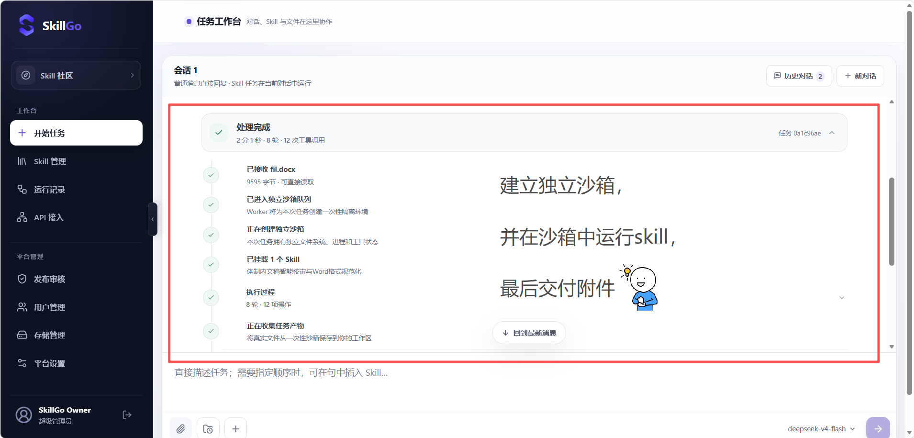
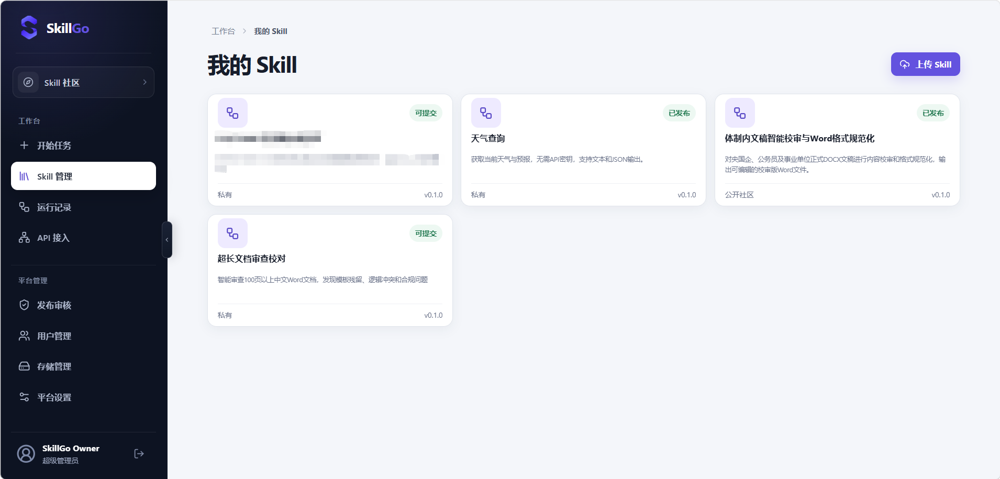
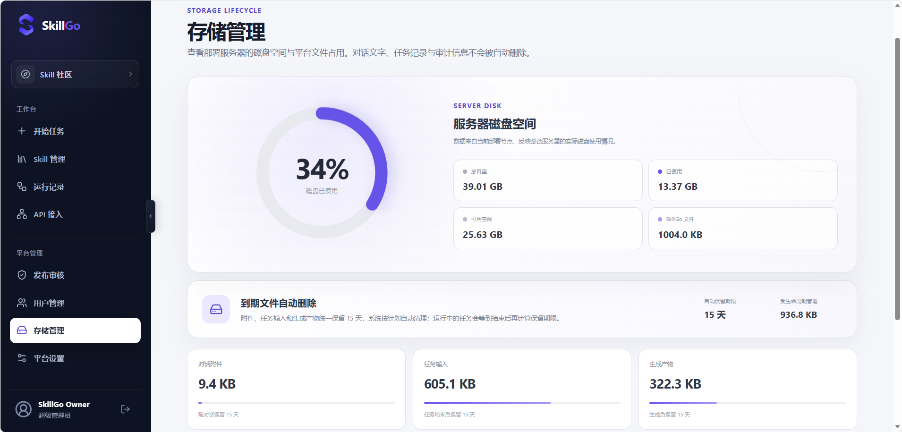

<p align="center">
  
</p>

<h1 align="center">SkillGo</h1>

<p align="center">
  让 Skill 变成每个人的能力。<br />
  <sub>A self-hosted, multi-user Skill platform with isolated per-task execution.</sub>
</p>

<p align="center">
  
  
  
  
  <a href="https://github.com/Max-cu/SkillGo/releases"></a>
</p>

<p align="center">
  <a href="#项目定位">项目定位</a> ·
  <a href="#核心能力">核心能力</a> ·
  <a href="#执行与隔离">执行与隔离</a> ·
  <a href="#快速开始">快速开始</a> ·
  <a href="#文档">文档</a> ·
  <a href="deploy/README.md">部署指南</a>
</p>

SkillGo 是一个可私有化部署的多用户 Skill 平台。它把 Skill 的上传、版本、审核、运行、产物交付和 API 接入放进同一条闭环，并为需要脚本、工具或文件处理的任务提供独立沙箱。

普通消息可以直接流式调用模型；使用 Skill 的任务会留下可追踪的运行记录。已发布的固定 Skill 版本还可以部署为带独立密钥的 API Endpoint，供其他系统调用。

<p align="center">
  
</p>

## 项目定位

SkillGo 不只是 Skill 仓库，也不只是聊天界面。它关注的是如何让 Skill 成为一个**可治理、可执行、可验证、可接入业务**的运行单元：

```text
上传 Skill → 固定版本 → 审核发布 → 发起任务 → 隔离执行 → 验证产物 → 网页或 API 交付
```

| 环节 | SkillGo 提供的能力 |
| --- | --- |
| 治理 | ZIP/目录结构检查、不可变版本、权限声明、审核、发布与社区可见性 |
| 协作 | 普通对话、附件工作区、多 Skill 顺序编排与任务时间线 |
| 执行 | 租约 Worker、每次尝试独立 Volume 与容器、gVisor `runsc` |
| 交付 | 只接收真实输出文件，并校验大小、SHA-256 与文件结构 |
| 接入 | 将已发布的固定版本部署为同步或异步 API Endpoint |

> SkillGo 仍处于积极开发阶段。公网正式部署应配置 TLS、妥善保管密钥并限制 Worker 对 Docker Socket 的宿主访问范围。

## 核心能力

- **Skill 生命周期**：兼容以顶层 `SKILL.md` 为入口的 Agent Skill，支持可选的 `skillgo.yaml`；版本可提交、审核、发布且发布后保持不可变。
- **任务工作台**：支持普通模型对话、附件、多 Skill 编排、步骤事件、取消、重试和历史任务。
- **任务级沙箱**：每次执行尝试使用独立 Docker Volume 与容器；任务结束、取消、超时或租约失效后回收。
- **可验证产物**：只有写入 `/workspace/output`、持久化成功并通过完整性检查的真实文件才能作为任务产物交付。
- **多用户与角色**：提供成员、管理员和唯一超级管理员，资源访问在 API 与存储层按所有者校验，关键操作写入审计。
- **私有模型**：通过 OpenAI-compatible 接口接入模型，可在管理界面维护多个模型并设置平台默认项。
- **业务 API**：已发布版本可创建独立 Endpoint；密钥只完整显示一次，服务端仅保存前缀和 SHA-256 摘要。
- **生命周期管理**：管理员可以查看服务器磁盘与平台文件占用；附件、任务输入和产物按配置自动到期清理。

## 界面预览

<table>
  <tr>
    <td width="50%">
      
      <br /><sub>Skill 管理：私有版本、审核状态与社区发布</sub>
    </td>
    <td width="50%">
      
      <br /><sub>存储管理：服务器磁盘、文件分类与自动保留期限</sub>
    </td>
  </tr>
</table>

## 执行与隔离

<p align="center">
  
</p>

SkillGo 会根据 Skill 内容和权限声明识别执行画像：

| 执行画像 | 运行方式 |
| --- | --- |
| 普通消息 | API 直接流式调用模型，不创建任务容器 |
| `instruction_only` | 由可信模型执行路径处理，不运行不受信任脚本 |
| `sandbox_required` | 创建持久任务，由 Worker 在独立沙箱中执行 |
| `platform_tools` | 所需平台工具尚未安全接入时保持阻断并明确提示 |

### gVisor 在 SkillGo 中的位置

普通 Docker 容器与宿主机共享 Linux 内核。SkillGo 在创建真正执行 Skill 的容器时显式传入 `runtime=runsc`，让 gVisor 在任务进程和宿主 Linux 内核之间提供额外的系统调用隔离层：

```text
FastAPI 控制面 ──► PostgreSQL：任务、归属、状态与审计
                         │
                         ▼ 租约领取
可信 Worker：模型编排、Docker Socket、沙箱生命周期
  │
  ├─► 一次性 Stager ──► 本次 execution_id 的 Docker Volume
  │    断网，只负责写入固定 Skill 版本和任务输入
  │
  └─► Docker create(runtime="runsc")
         └─► gVisor runsc
                └─► 非 root Skill 进程，仅挂载本次 /workspace
```

`runsc` 安装在 Linux 宿主机并注册到 Docker，而不是安装在 API、Worker 或任务容器内部。Worker 启动时会检查 Runtime 和沙箱镜像；任一项缺失都会将运行环境报告为不可用，不会静默退回普通 `runc` 执行 Skill。

### 一次任务尝试如何运行

1. API 将用户、固定 Skill 版本、输入文件和执行画像保存为 `WorkflowJob`。
2. Worker 通过数据库行锁领取任务，为本次尝试生成独立 `execution_id`、租约令牌和过期时间，并持续心跳。
3. Worker 创建带 `job_id` 与 `execution_id` 标签的专用 Docker Volume。一个断网的临时 Stager 只获得 `CHOWN` 能力，将本次选定的 Skill 和输入写入 Volume，设置为任务用户所有后立即销毁；Stager 不执行 Skill 代码。
4. Worker 使用受控基础镜像创建实际任务容器，指定 `runtime=runsc`，并只把本次 Volume 挂载为可写 `/workspace`。
5. 模型负责计划和选择受限工具，Worker 负责路径、命令、超时和状态校验；实际命令始终以 `10001:10001` 身份在 gVisor 容器内执行。
6. 命令超时会直接销毁整个容器，避免只终止入口进程后遗留子进程。重试会获得新的 `execution_id`、容器和 Volume；旧租约即使恢复也不能提交结果。
7. Worker 只收集 `/workspace/output` 下声明的常规文件，并逐个拒绝符号链接、空文件、越界路径和超限文件；持久化后重新核对大小、SHA-256 与文件结构，再把任务标记为成功。
8. 成功、失败、取消或超时都会回收本次容器和 Volume；Worker 启动与租约恢复逻辑还会按标签清理崩溃后遗留的孤儿资源，同时避开仍有有效租约的任务。

### 强制执行的沙箱边界

| 边界 | 当前实现 |
| --- | --- |
| Runtime | 实际 Skill 容器强制使用配置的 `runsc`；Docker 未注册时拒绝运行 |
| 身份 | Skill 命令固定为非 root `10001:10001` |
| 文件系统 | 容器根文件系统只读；唯一持久可写位置是本次 `/workspace`，`/tmp` 为独立 `tmpfs` |
| Linux 权限 | `cap_drop=ALL`、`no-new-privileges`，不挂载设备、宿主目录或 Docker Socket |
| 资源 | 默认 768 MiB 内存、1 CPU、128 PIDs；单命令最多 120 秒、任务最多 30 分钟，均可配置 |
| 网络 | 默认 `network_mode=none`；仅在运行画像明确需要时启用 bridge，目前不提供域名级出口白名单 |
| 密钥 | 任务容器不接收数据库连接、JWT Secret、用户凭据、模型 API Key 或 Endpoint Key |
| 产物 | 只允许 `/workspace/output` 下经过大小、哈希和结构复核的真实文件，单文件默认上限 50 MiB |

这里的隔离粒度是“**一次任务执行尝试一套临时环境**”，不是为每个用户长期保留一台虚拟机。gVisor 也不是完整虚拟机或宿主安全管理的替代品：持有 Docker Socket 的 Worker 仍属于可信执行面，需要限制访问范围并及时更新 Linux、Docker 和 gVisor；API、Web 与实际 Skill 容器都不挂载该 Socket。

实现可直接查看 [`sandbox_runtime.py`](backend/app/sandbox_runtime.py) 与 [`sandbox_worker.py`](backend/app/sandbox_worker.py)，整体设计见 [产品与技术架构](docs/PRODUCT_ARCHITECTURE.md) 和 [Agent 内核](docs/agent-kernel.md)。完整部署自检会真正启动一个 `runsc`、非 root、只读且断网的测试容器，而不是只检查配置文本。

## Skill API

已审核发布且当前环境可执行的 Skill 版本可以固定为 Endpoint：

| Skill 类型 | 调用方式 | 返回 |
| --- | --- | --- |
| `instruction_only` | `POST /api/v1/invoke/{slug}` | 同步结构化结果与 `run_id` |
| `sandbox_required` | `POST /api/v1/workflow-endpoints/{slug}/jobs` | `202 Accepted`、任务地址与后续产物 |

异步 Endpoint 支持 `Idempotency-Key`，重复提交不会重复创建任务。外部请求仍遵守 Endpoint 所有权、任务归属、沙箱隔离和产物验证边界。调用契约见 [工作流 API](docs/workflow-api.md)，示例见 [Python 客户端](examples/workflow_api_client.py)。

## 数据与安全边界

| 项目 | 当前行为 |
| --- | --- |
| 对话文字、任务状态、结果摘要、审计 | 不随文件生命周期自动删除 |
| 对话附件、任务输入、生成产物 | 默认保留 15 天，可通过环境变量调整 |
| 运行详细事件 | 成功默认保留 7 天，失败或取消默认保留 30 天 |
| 数据库 | 生产使用 PostgreSQL；开发环境支持 SQLite；Alembic 管理迁移 |
| 文件存储 | 按用户、会话或任务组织路径，并再次校验根目录边界 |
| 身份 | Argon2 密码哈希、带签发方/受众/过期时间的 JWT、三级角色 |

Skill 包、模型响应、上传文件和工具结果都被视为不可信输入。更多约束与漏洞报告方式见 [安全政策](SECURITY.md)。

## 快速开始

### 基础模式

基础模式适合查看界面、管理 Skill 和测试普通对话，需要 Docker Compose，但不启动沙箱 Worker。

```powershell
Copy-Item .env.example .env
# 编辑 .env，替换数据库密码、JWT Secret、Bootstrap 邮箱和密码
docker compose up -d --build
```

默认访问 `http://127.0.0.1:8080`。

### 完整沙箱模式

完整模式需要 Linux、Docker Engine，以及已向 Docker 注册的 gVisor `runsc`。配置 `.env` 和 `deploy/ecs.env` 后：

```bash
docker compose --env-file .env --env-file deploy/ecs.env --profile build-only build sandbox-runtime
bash deploy/preflight.sh
docker compose --env-file .env --env-file deploy/ecs.env --profile sandbox up -d --build
SKILLGO_INSTALL_ROOT="$PWD" bash deploy/verify-ecs.sh
```

服务器规格、密钥生成、Docker GID、gVisor 安装、备份恢复、升级和回滚见 [完整部署指南](deploy/README.md)。生产环境建议固定到 [GitHub Release](https://github.com/Max-cu/SkillGo/releases)，不要直接追随 `main`。

### 本地开发

```powershell
Copy-Item backend\.env.example backend\.env
# 编辑 backend/.env
python -m venv .venv
.\.venv\Scripts\python.exe -m pip install -r backend\requirements-dev.lock
.\.venv\Scripts\python.exe -m uvicorn app.main:app --app-dir backend --env-file backend/.env --reload
```

另开终端：

```powershell
Set-Location frontend
npm.cmd ci
npm.cmd run dev
```

前端为 `http://127.0.0.1:5173`，API 文档为 `http://127.0.0.1:8000/api/docs`。详细说明见 [开发文档](docs/development.md)。

## 验证

```powershell
.\.venv\Scripts\python.exe -m pytest -q
Set-Location frontend
npm.cmd run build
```

CI 同时验证后端测试、前端生产构建、部署脚本与完整沙箱 Compose 配置。

## 技术栈

| 层级 | 实现 |
| --- | --- |
| Web | React、TypeScript、Vite、Nginx |
| API | Python 3.12、FastAPI、Pydantic、SQLAlchemy |
| 数据 | PostgreSQL、SQLite（开发）、Alembic |
| 模型 | OpenAI-compatible Chat Completions / tool calling |
| 执行 | 数据库租约 Worker、Docker SDK、gVisor `runsc` |
| 质量 | pytest、TypeScript、Vite、GitHub Actions |

## 文档

| 文档 | 内容 |
| --- | --- |
| [文档索引](docs/README.md) | 当前文档与历史规划材料的边界 |
| [完整部署指南](deploy/README.md) | Linux、gVisor、配置、升级、备份与回滚 |
| [产品与技术架构](docs/PRODUCT_ARCHITECTURE.md) | 产品边界、执行分层与隔离模型 |
| [Agent 内核](docs/agent-kernel.md) | 计划、工具、上下文、验证与产物门禁 |
| [工作流 API](docs/workflow-api.md) | 异步 Endpoint、幂等、状态与产物下载 |
| [技术设计](docs/technical-design.md) | 数据模型、控制面、执行面与安全约束 |
| [开发文档](docs/development.md) | 本地环境、模型配置、测试与 Compose |

## 项目结构

| 路径 | 用途 |
| --- | --- |
| `backend/app` | FastAPI、领域服务、Agent、Worker 与沙箱协议 |
| `backend/tests` | 后端回归测试 |
| `frontend/src` | React 工作台、社区与管理界面 |
| `sandbox-runtime` | 受控任务沙箱镜像 |
| `examples` | 示例 Skill 与 API 客户端 |
| `deploy` | 部署、预检、升级、备份恢复与自检脚本 |

## 参与和许可证

贡献流程见 [CONTRIBUTING.md](CONTRIBUTING.md)，漏洞请按 [SECURITY.md](SECURITY.md) 报告。SkillGo 采用 [MIT License](LICENSE)。

如果你认同“让 Skill 在独立、可治理的环境中真正运行”这个方向，欢迎在 [GitHub 仓库](https://github.com/Max-cu/SkillGo) 点一个 ⭐ Star。
