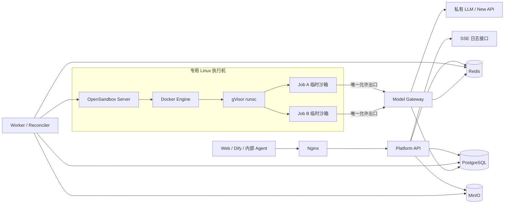
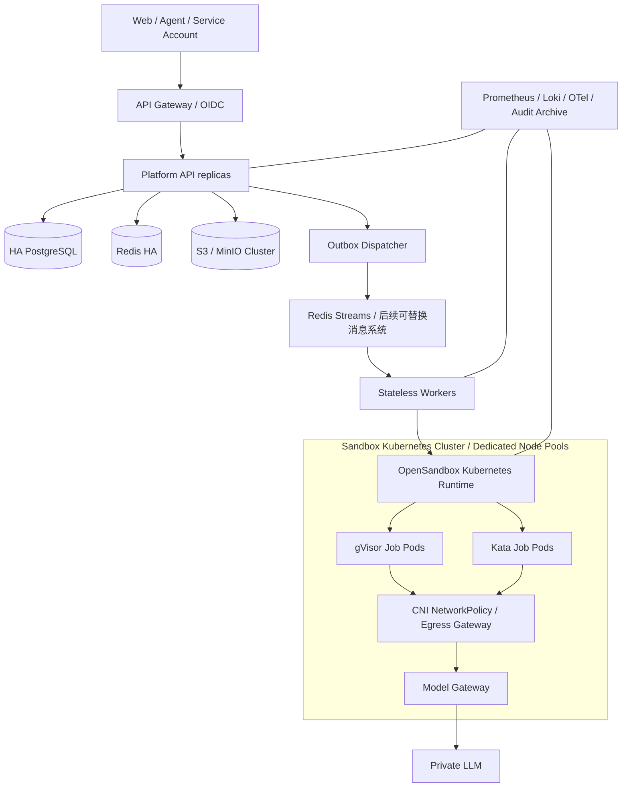
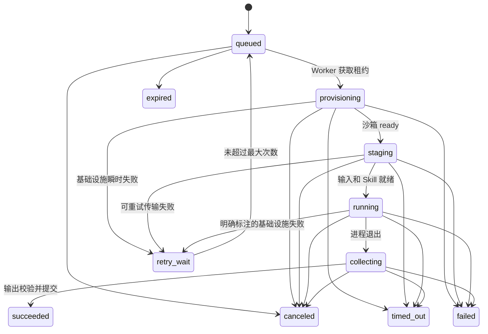
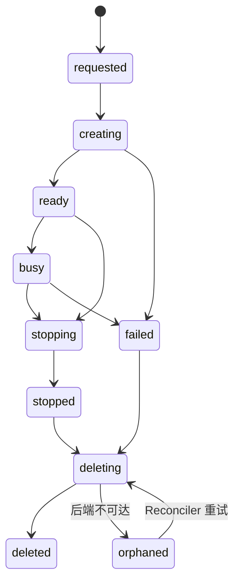

# SkillGo Skill 工作流与社区平台技术设计

> 版本：v0.2（产品方向修订）
> 日期：2026-08-03
> 范围：私有化部署、用户上传与社区分享、Skill 工作流、API Endpoint、代码型 Skill 隔离执行

> 产品功能、角色、社区、网页和 V1 范围以 [产品需求规格 V1](./product-requirements-v1.md) 为准。本文件继续作为执行、安全、资源和多租户底层设计。

## 0. 结论先行

这个项目是现实可行的，但“多用户不互相干扰”不能只理解为给每个任务启动一个 Docker 容器。完整边界至少包括：

1. 业务对象和数据库行的租户隔离；
2. 文件、日志、缓存、临时凭据的归属隔离；
3. 进程、文件系统、CPU、内存、PID 和磁盘隔离；
4. 默认拒绝的网络出口和内网 SSRF 防护；
5. 镜像、Skill 包和依赖的供应链控制；
6. 超时、取消、Worker 崩溃后的兜底清理；
7. 沙箱控制面的鉴权与执行节点隔离。

建议的 MVP 基线是：

- 普通用户可以上传、版本化、私有测试和提交发布 Skill；
- 社区公开/实例内部共享版本必须经过自动扫描和管理员审核；
- V1 优先支持不含任意代码的指令型 Skill，由 Agent Runner、Model Gateway 和 Tool Gateway 执行；
- 代码型步骤才进入一次性沙箱，一个 Attempt 对应一个临时沙箱，结束必销毁；
- 代码型 Skill 不允许自由拼接 Shell，不允许运行时在线 `pip install`；
- OpenSandbox 作为沙箱生命周期和命令/文件操作底座；
- Docker 作为本地运行后端，所有 Skill 容器强制使用 gVisor `runsc`；
- PostgreSQL 是业务状态唯一事实源，Redis Streams 只承载队列、租约和实时日志；
- MinIO 保存原始输入、Skill 包、输出和归档日志；
- 沙箱默认无网络；确需调用模型时，只允许到模型网关；
- 控制面永远不向普通用户暴露 OpenSandbox、Docker API 或任意命令执行接口；
- 执行机应是专用、可重装的 Linux 主机，不与重要生产服务混部。

MVP 不建议做“用户持久工作区 + 会话常驻沙箱”。后者会同时引入工作区快照、一致性、并发会话、休眠恢复、长期凭据、僵尸进程和跨任务污染等问题。会话可以先作为任务的逻辑分组，等固定入口执行模型稳定后再增加持久工作区。

## 1. 项目边界与威胁模型

### 1.1 MVP 信任假设

- 用户是企业内部已认证用户，但用户输入文件仍按不可信数据处理；
- 普通用户可以上传 Skill；上传、公开发布、下载、安装和执行是五个独立权限；
- 用户上传不等于立即执行。公开版本和代码型版本必须经过扫描、审核和权限确认；
- LLM 生成的文本不具有权限，不能改变 Manifest 或平台策略；
- 执行节点可能被单个沙箱消耗资源或尝试逃逸，因此执行节点不保存唯一业务数据；
- 平台管理员和执行节点管理员暂视为高信任角色，MVP 不解决恶意基础设施管理员问题。

### 1.2 后续正式版威胁升级

如果未来允许完全不可信代码、外部租户或 Agent Shell，威胁模型必须升级：

- 将 gVisor 运行池与 Kata/Firecracker 运行池分开；
- 完全不可信代码默认使用轻量虚拟机级隔离；
- 控制面与执行面分主机、分网络、分凭据；
- 使用 Kubernetes 节点池、RuntimeClass、NetworkPolicy、准入策略和节点污点；
- 增加镜像签名验证、依赖代理、恶意文件检测和独立安全审计。

### 1.3 核心不变量

以下约束应写进代码审查清单和自动化测试：

- API 从认证上下文取得 `tenant_id` 和 `user_id`，不接受客户端指定；
- 所有租户对象查询至少包含 `tenant_id`，用户私有对象还包含 `user_id`；
- 普通用户不能直接创建沙箱、选择镜像、入口、运行时、挂载、网络或资源上限；
- 每个 Job Attempt 只对应一个 Sandbox，每个 MVP Sandbox 只执行一个 Attempt；
- 所有权限取交集，Manifest 只能申请权限，不能授予权限；
- 永久 Secret 不进入 Skill 的环境变量、命令行、文件或日志；
- 任何终态都要撤销临时 Token、停止执行并触发沙箱清理；
- Worker 重复消费消息不得重复提交结果或越过较新的 Attempt。

## 2. 推荐技术栈

| 层 | MVP 推荐 | 说明 |
|---|---|---|
| Web | React + TypeScript | 社区、用户工作台、Run 调试台、管理员和超级管理员后台 |
| API | Python 3.12 + FastAPI + Pydantic v2 | 与 OpenSandbox Python SDK、Manifest 校验契合 |
| ORM/迁移 | SQLAlchemy 2 + Alembic | 显式事务和迁移 |
| 主数据库 | PostgreSQL 16+ | 业务状态、授权、审计、租约事实源 |
| 队列/实时流 | Redis 7+ Streams | Consumer Group、短期日志流、限流和租约缓存 |
| 对象存储 | MinIO | 输入、输出、Skill 包、归档日志 |
| 沙箱控制 | OpenSandbox，封装 `SandboxBackend` | 不让业务层直接依赖其 DTO |
| 容器运行 | Docker Engine + gVisor `runsc` | `runsc` 安装在 Linux 宿主机，不安装在普通业务容器内 |
| 模型网关 | 独立 FastAPI 服务或平台内独立进程 | 对外保持 OpenAI 兼容接口，对内使用真实模型凭据 |
| 反向代理 | Nginx | TLS、上传限制、SSE 透传 |
| 可观测性 | Prometheus + Grafana；结构化 JSON 日志 | MVP 可先保留接口和指标，部署可稍后 |
| 身份 | 优先接企业 OIDC；否则本地账号 + Argon2id | 有现成 SSO 时不要再造身份系统 |

不建议 MVP 同时引入 Kafka、Kubernetes、Service Mesh、工作流引擎、Vault 和微服务拆分。Platform API、Worker、Model Gateway 可以先共享一个代码仓库，但以不同进程和最小权限运行。

## 3. OpenSandbox 适配性与替代方案

### 3.1 OpenSandbox 是否适合

适合。当前 OpenSandbox 已提供统一生命周期 API/SDK、Docker 和 Kubernetes 后端、命令与文件操作、资源限制、安全运行时配置、Egress 组件和 Credential Vault。其官方说明也明确支持 gVisor、Kata 和 Firecracker 类型的安全运行时。

本项目可直接复用：

- 创建、查询、续期和销毁沙箱；
- 在沙箱中执行命令并取得 stdout/stderr/退出码；
- 文件写入、读取、上传和下载；
- Docker/Kubernetes 后端适配；
- CPU、内存和沙箱 TTL 等底层参数；
- gVisor/Kata Runtime 配置；
- Egress Sidecar 的 FQDN、IP/CIDR 默认拒绝策略；
- 后续可评估复用 Credential Vault。

仍需自研：

- tenant/user/session/job 的领域模型；
- 用户、角色、Skill 授权、配额和审批；
- Skill ZIP 安全扫描、Manifest 规范和策略编译；
- 任务队列、幂等、重试、取消、超时和清理协调；
- 文件归属、对象存储、下载授权和保留策略；
- 模型临时 Token、模型级权限、预算和用量统计；
- 审计日志、管理后台和用户可见的实时日志；
- OpenSandbox 管理 API 的认证、网络边界和故障补偿；
- 运行镜像构建、扫描、签名与允许清单。

需要特别注意：

- OpenSandbox 是执行底座，不是本平台的多租户授权系统；
- OpenSandbox Server 具有创建高权限运行资源的能力，必须只允许 Worker 访问；
- Docker 后端通常需要访问 Docker Socket；持有该 Socket 等同于宿主机 root 权限，不能把它挂给 Platform API 或 Skill；
- OpenSandbox 原生资源字段未必覆盖 PID、可写磁盘、文件数和日志量等全部平台限制，缺失项必须由运行模板、宿主配额和 Worker 监控补齐，并纳入 PoC；
- 固定入口优先使用结构化 argv；若某个 OpenSandbox Command API 版本只接受 Shell 字符串，应改用平台控制的 Launcher 和固定 JSON Contract，绝不能把用户输入拼入命令字符串；
- OpenSandbox 文档中的某些示例给 `runsc` 配置了 `--network=host`。本方案禁止这样做；gVisor 官方明确说明 host 网络会降低隔离；
- OpenSandbox 仍在快速演进，必须固定版本并做兼容性/安全验收，不能长期跟随 `latest`。

### 3.2 建议的抽象层

业务层只依赖内部接口：

```text
SandboxBackend
├── create(spec) -> sandbox_ref
├── put_files(sandbox_ref, files)
├── run(sandbox_ref, argv, deadline, log_sink) -> execution_result
├── get_usage(sandbox_ref)
├── terminate(sandbox_ref, grace_seconds)
└── delete(sandbox_ref)
```

内部 `SandboxSpec` 只包含平台编译后的有效策略。OpenSandbox ID、Docker Container ID 和 Kubernetes Pod 名都不作为外部 API 的稳定标识。

### 3.3 替代方案比较

| 方案 | 优点 | 与本项目的差异 | 结论 |
|---|---|---|---|
| OpenSandbox | Docker/K8s 双后端、统一 SDK、命令/文件/网络能力完整 | 项目较新，需固定版本和验收 | 当前首选 |
| 直接 Docker SDK + gVisor | MVP 依赖少、控制直接 | 要自己处理文件、命令流、TTL、网络、清理和 K8s 迁移 | 仅作为 OpenSandbox 不满足验收时的备选 |
| Daytona | 平台、快照、终端、持久环境能力丰富 | 与自研控制面重叠较多，对固定入口批任务偏重 | 如果目标转向长期开发环境可重新评估 |
| E2B Self-host | Agent/Code Interpreter 生态成熟 | 自托管更偏云基础设施，通用单机 Linux 不是最顺路径 | 当前私有单机 MVP 不优先 |
| Kubernetes SIG agent-sandbox | 适合 K8s 上有稳定身份、存储和 Warm Pool 的状态型沙箱 | 依赖 Kubernetes，不适合 Compose MVP | 正式版会话持久沙箱候选 |
| Kata/Firecracker/gVisor | 提供隔离运行时 | 不是用户、任务、文件和生命周期管理平台 | 与 OpenSandbox 组合使用，不是替代关系 |

### 3.4 采用前必须通过的 PoC 门槛

在写完整业务前，先做一个不超过一周的底座验证：

1. 每个沙箱实际使用 `runsc`，缺失运行时时 OpenSandbox 必须拒绝启动；
2. CPU、内存、PID、TTL 在压力和故障场景下真实生效；
3. Worker 被 `kill -9` 后，沙箱仍能由 TTL/Reconciler 清理；
4. `network: none` 无法访问宿主机、元数据地址、Docker API和公司内网；
5. Allowlist 无法被直接 IP、备用 DNS、DoH、DNS Rebinding 绕过；
6. 文件 API 无法越过工作目录访问宿主机或其他沙箱；
7. 取消能终止整个进程树，而不只是入口进程；
8. OpenSandbox/execd 控制接口有认证且 Skill 进程不可调用；
9. 目标并发下启动延迟、日志流和清理无资源泄漏；
10. 使用固定版本镜像和组件，重启后行为可重复。

任一关键安全项不通过时，不用业务代码“补一层判断”掩盖，应修复底座配置或更换运行后端。

## 4. MVP 总体架构



网络至少分为：

- `public-edge`：仅 Nginx 暴露；
- `control`：API、Worker、PostgreSQL、Redis、MinIO；
- `sandbox-management`：仅 Worker 到 OpenSandbox；
- `sandbox-egress`：沙箱只到受控 Egress/Model Gateway；
- Docker Socket 只在执行节点由 OpenSandbox 持有。

即使 MVP 暂时放在一台专用测试服务器，也必须逻辑分网、不同凭据、不同容器用户，并把该主机视为可整体重装的执行环境。

## 5. 正式版总体架构



正式版控制原则：

- 每个 Job Attempt 一个 Pod；
- `runtimeClassName` 由平台策略决定，普通用户不可指定；
- gVisor 节点池服务审核过的内部 Skill；
- Kata/Firecracker 节点池服务完全不可信代码；
- Pod 使用 `activeDeadlineSeconds`、requests/limits、`ephemeral-storage` 限制；
- Pod Security Admission、准入策略、镜像签名验证和 CNI NetworkPolicy 统一下发；
- Worker 无本地状态，文件只在对象存储，任务状态只在 PostgreSQL；
- 会话持久沙箱另设运行池，不与批任务复用状态机。

## 6. 隔离模型与领域关系

### 6.1 MVP 关系

```text
Tenant 1 ── N User
User   1 ── N Session
Session 1 ── N Job
Job    1 ── N JobAttempt
JobAttempt 1 ── 1 Sandbox
Job    1 ── N InputFile / OutputFile / JobEvent
Skill  1 ── N Immutable SkillVersion
Job    N ── 1 SkillVersion（创建任务时锁定）
```

`session_id` 用于对话或任务分组，不等于沙箱。MVP 的同一 Session 中两个任务仍运行在两个干净沙箱里。

### 6.2 为什么 MVP 选任务级临时沙箱

| 维度 | 任务级临时沙箱 | 会话级持久沙箱 |
|---|---|---|
| 数据串扰 | 每次干净环境，最低 | 前一任务状态可能污染后一任务 |
| 清理 | 任务终态统一销毁 | 需空闲检测、休眠、恢复和快照 |
| 取消/超时 | 杀整个沙箱即可 | 不能误杀同会话其他活动 |
| 重试 | 新环境重复执行 | 需判断工作区是否已被部分修改 |
| 启动延迟 | 每任务有冷启动 | 可复用环境，交互更快 |
| 依赖安装 | 适合预构建镜像 | 可缓存依赖 |
| 成本 | 并发时容器更多 | 空闲容器占资源 |
| 适用场景 | 固定入口批处理 | Agent Shell、IDE、长期交互 |

因此 MVP 采用任务级临时沙箱。后续增加：

```text
用户持久 workspace（对象存储/PVC 快照）
        +
会话级可恢复 sandbox
        +
任务级 attempt/audit
```

但持久 workspace 不能是执行机上的普通共享目录，也不能在两个活动沙箱间同时读写。需引入独占租约或版本化快照。

## 7. Skill 包与 Manifest 规范

### 7.1 包结构

```text
skill-name/
├── SKILL.md
├── skillgo.yaml              # 可选，SkillGo 部署扩展
├── requirements.lock          # 可选，仅构建阶段使用
├── src/
├── assets/
└── tests/
```

约束：

- ZIP 解压后的文件总数、总大小、单文件大小和目录深度均有限制；
- 拒绝绝对路径、`..`、空字节、设备文件、FIFO、Socket、硬链接和越界符号链接；
- 拒绝同名 Unicode 混淆、大小写碰撞和压缩炸弹；
- `SKILL.md` 使用标准 Agent Skills Frontmatter，至少声明 `name` 和 `description`，且不能授予运行权限；
- `skillgo.yaml` 承载输入输出 Schema、运行类型和权限申请；旧版 `manifest.yaml` 只作为兼容入口；
- SkillVersion 审批后不可变，以包 SHA-256 和运行镜像 digest 标识；
- `requirements.lock` 仅允许审核构建流水线读取，不在任务中联网安装；
- 生产镜像只能来自平台允许的私有 Registry，并按 digest 固定。

推荐的发布路径是：

```text
上传 ZIP
 -> 静态安全扫描和 SKILL.md 校验
 -> 私有模型生成可编辑的社区名称、简介、说明和分类
 -> 可选 SkillGo Manifest 校验与策略归一化
 -> 隔离 Builder 中按 lock 文件构建 SkillVersion OCI 镜像
 -> SBOM / 漏洞 / 恶意文件扫描
 -> 签名并推送私有 Registry
 -> 管理员审批镜像 digest
 -> 运行阶段只拉取该 digest，不再安装依赖
```

Builder 本身也按不可信执行环境处理：没有生产凭据，只能访问内部依赖代理，有 CPU/内存/PID/磁盘/时间限制。某些 Python 包在安装时会运行构建脚本，因此“只在构建阶段安装”不等于可以在控制面直接执行。

为了更快完成最初 PoC，可以暂时只接受“一个预置 Python Profile 已包含全部依赖”的示例 Skill，把经过扫描的源包只读写入 `/skill`；但在支持任意 `requirements.lock` 前必须补上隔离构建流水线。

### 7.2 权限计算

```text
effective_policy
  = manifest_requested
  ∩ approved_skill_version_policy
  ∩ tenant_policy
  ∩ user_or_role_policy
  ∩ platform_hard_limit
  ∩ per_job_lower_override
```

资源数值取最小值，允许项取交集，禁止项优先。后台保存 Manifest 原文、标准化结果、审批策略快照和最终有效策略，便于审计。

### 7.3 完整示例

```yaml
apiVersion: skillgo.io/v1alpha1
kind: Skill

metadata:
  name: standard-checker
  version: 1.0.0
  displayName: 工程标准智能校验
  description: 提取并校验工程文件中的标准编号
  labels:
    category: document

spec:
  execution:
    mode: fixed
    runtimeProfile: python-3.12
    image:
      repository: registry.internal/skills/standard-checker
      digest: "sha256:由构建审批流程写入"
    workingDirectory: /skill
    entrypoint:
      - python
      - -I
      - /skill/src/main.py
    contractFile: /run/skill/input.json

  inputs:
    - name: document
      type: file
      required: true
      acceptedMediaTypes:
        - application/vnd.openxmlformats-officedocument.wordprocessingml.document
      maxBytes: 52428800
    - name: strict
      type: boolean
      required: false
      default: true

  outputs:
    - name: report
      type: file
      path: /output/report.json
      required: true
      mediaType: application/json
      maxBytes: 10485760
    - name: attachments
      type: directory
      path: /output/attachments
      required: false
      maxFiles: 20
      maxBytes: 52428800

  environment:
    literals:
      LOG_LEVEL: INFO
    platform:
      - JOB_ID
      - SKILL_INPUT_FILE
    secretRefs: []

  resources:
    cpu: "1"
    memory: 1Gi
    memorySwap: disabled
    pids: 128
    writableDisk: 1Gi
    tmpfs: 256Mi
    timeoutSeconds: 600
    terminationGraceSeconds: 5
    maxLogBytes: 10485760

  permissions:
    network:
      mode: allowlist
      rules:
        - service: model-gateway
          protocols: [https]
          ports: [443]
      denyPrivateRanges: true
    filesystem:
      root: read-only
      skill: read-only
      input: read-only
      output: read-write
      workspace: ephemeral-read-write
      tmp: tmpfs
    process:
      shell: false
      dependencyInstall: false
      allowSubprocess: true
    internalServices:
      - name: model-gateway
        scopes:
          - model:qwen-private

  health:
    startupTimeoutSeconds: 30

  result:
    successExitCodes: [0]
    retryableExitCodes: [75]
    userErrorExitCodes: [2, 64]
```

### 7.4 字段语义

- `metadata.name`：DNS 风格小写名，租户内唯一；
- `metadata.version`：严格 SemVer，不使用可变的 `latest`；
- `runtimeProfile`：平台管理的运行时模板，决定 UID、基础镜像、安全参数和可用工具；
- `image.digest`：审批构建后由平台写入；普通上传者不能指向任意镜像；
- `entrypoint`：argv 数组，不接受 Shell 字符串，不拼接用户输入；
- `contractFile`：平台生成 JSON，记录已校验的标量输入和文件路径，避免命令注入；
- `inputs`：平台校验类型、大小、MIME；MIME 必须同时做扩展名、魔数和解析器校验；
- `outputs.path`：必须位于 `/output`，收集时再次做规范化路径和链接检查；
- `environment.literals`：仅允许非敏感值；平台保留变量名不可覆盖；
- `secretRefs`：只引用平台 Secret 名，不包含 Secret 值；MVP 先禁用通用 Secret；
- `resources`：申请值，不是最终授权值；
- `network.rules.service`：引用管理员维护的服务目录，不让 Skill 自由填写 URL/IP；
- `shell`：MVP 固定为 `false`；
- `dependencyInstall`：MVP 固定为 `false`，依赖在镜像构建阶段锁定；
- `health`：对一次性固定入口只表示启动期限；长期服务型 Skill 后续才支持探针；
- `result`：映射进程退出码到业务分类，任务状态仍由平台状态机决定。

### 7.5 两种执行模式

固定入口模式：

- 平台只执行审批快照中的 argv；
- 用户输入通过 JSON Contract 和只读文件传入；
- 不开放通用命令 API；
- 依赖预装、镜像只读、网络按服务目录编译；
- 适合 MVP 和大多数文档处理 Skill。

Agent Shell 模式：

- 后续单独定义 `mode: agent-shell` 和更高风险运行池；
- 每次命令记录 Agent、模型、用户、argv、cwd、开始/结束时间、退出码和截断信息；
- 单命令有超时，总会话也有 TTL，输出有单行和总量限制；
- 命令黑名单只能作为告警和误操作保护，不能作为安全边界；
- 包管理只能经内部镜像代理，最好按锁文件安装到一次性虚拟环境；
- 默认无永久 Secret，模型调用仍经临时 Token/凭据代理；
- 对完全不可信 Agent Shell 优先使用 Kata/Firecracker，而不是仅用普通 Docker；
- WebSocket/PTY 只对 Agent Shell 开放，固定入口不需要交互终端。

## 8. 数据库设计

### 8.1 通用规则

- 主键使用 UUIDv7/ULID；外部 ID 带不可猜前缀，但不可依赖“难猜”做授权；
- 所有租户业务表包含 `tenant_id NOT NULL`；
- 关键关联使用复合外键 `(tenant_id, id)`，防止跨租户错误关联；
- 所有时间使用 UTC `timestamptz`；
- 软删除使用 `deleted_at`，执行记录和审计日志通常不软删；
- 状态更新包含 `version` 乐观锁；
- Worker 跨租户账号和普通 API 账号分离；
- 建议对用户请求表启用 PostgreSQL RLS 作为纵深防御，API 每个事务执行 `SET LOCAL app.tenant_id`；
- PostgreSQL 只保存对象元数据，不保存大文件和完整长日志。

### 8.2 主要表

| 表 | 关键字段与约束 |
|---|---|
| `tenants` | `id, slug, name, status, quota_policy_id, created_at, deleted_at` |
| `users` | `id, tenant_id, subject, username, password_hash?, status, created_at, deleted_at`; `unique(tenant_id, username)` |
| `roles` | `id, tenant_id, name, permissions_json`; 系统角色可由特殊 tenant 表示 |
| `user_roles` | `tenant_id, user_id, role_id`; 复合 FK |
| `service_accounts` | Dify/内部 Agent 身份、scope、凭据哈希和过期时间 |
| `skills` | `id, tenant_id, name, display_name, owner_user_id, status, created_at, deleted_at`; `unique(tenant_id,name)` |
| `skill_versions` | `id, tenant_id, skill_id, semver, package_file_id, package_sha256, manifest_raw, manifest_normalized, image_digest, review_status, reviewer_id, approved_policy, created_at`; 版本不可变 |
| `user_skill_permissions` | `tenant_id, user_id, skill_id, effect, expires_at`; MVP 可直接授权，后续扩展 principal |
| `sessions` | `id, tenant_id, user_id, title, status, last_active_at, created_at, deleted_at`; MVP 不保存 sandbox 外键 |
| `jobs` | `id, tenant_id, user_id, session_id?, skill_version_id, state, priority, idempotency_key, policy_snapshot, manifest_snapshot, max_attempts, cancel_requested_at, deadline_at, error_code, error_message_safe, version, created_at, started_at, finished_at` |
| `job_attempts` | `id, tenant_id, job_id, attempt_no, state, worker_id, fence_token, lease_expires_at, sandbox_id?, started_at, finished_at, failure_class`; `unique(job_id,attempt_no)` |
| `sandboxes` | `id, tenant_id, job_attempt_id, backend, external_ref_encrypted, executor_id, state, runtime_class, expires_at, last_seen_at, deleted_at` |
| `files` | `id, tenant_id, owner_user_id, purpose, object_key, original_name, media_type, size_bytes, sha256, scan_status, encryption_key_ref?, created_at, expires_at, deleted_at` |
| `job_inputs` | `tenant_id, job_id, input_name, file_id?, scalar_value_json`; 输入名唯一 |
| `job_outputs` | `tenant_id, job_id, attempt_id, output_name, file_id, relative_path, is_partial`; 只公开获胜 Attempt 的输出 |
| `job_events` | 状态变更、警告、退出码等低频结构化事件；不逐行保存 stdout |
| `job_log_archives` | `job_id, attempt_id, file_id, first_seq, last_seq, truncated, bytes` |
| `resource_usage` | `job_id, attempt_id, cpu_seconds, peak_memory_bytes, io_read_bytes, io_write_bytes, network_rx, network_tx, llm_input_tokens, llm_output_tokens` |
| `temporary_tokens` | `id, tenant_id, user_id, job_id, attempt_id, token_hash, audience, scopes, budgets_json, expires_at, revoked_at, last_used_at`; 不保存明文 |
| `model_requests` | `request_id, tenant_id, job_id, attempt_id, model, status, token_usage, latency_ms, created_at`; 不默认保存 Prompt 原文 |
| `audit_logs` | `tenant_id, actor_type, actor_id, action, target_type, target_id, request_id, source_ip, metadata_safe, created_at`; 追加写 |
| `quota_policies` | 租户/角色/Skill 的并发、资源、每日调用和 Token 上限 |
| `executors` | 执行节点状态、容量、运行时版本、最后心跳；不保存宿主机 Secret |
| `outbox_events` | 与 Job 创建同事务写入，Dispatcher 负责可靠投递 Redis |

### 8.3 高风险越权点

- 根据裸 `job_id/file_id/session_id/sandbox_id` 查询；
- 先查询对象、后在 Python 中检查租户，期间已经读取敏感字段；
- `job_inputs.file_id` 未验证文件的 tenant、owner、scan_status；
- MinIO Object Key 使用客户端文件名或客户端路径；
- 给用户返回长期有效、未绑定对象的预签名 URL；
- 管理员列表接口漏加 tenant 范围；
- Worker 使用高权限数据库账号后复用普通 API 查询代码；
- SSE/日志订阅只校验连接时 Job 存在，没有校验归属；
- 重试后把失败 Attempt 的输出误标为当前 Job 输出；
- Dify 服务账号可替其他 tenant 提交 `user_id`；
- 审计、导出、搜索接口绕过常规 Repository 层。

## 9. API 设计

### 9.1 原则

- 外部 API 只暴露 Skill、文件、Session 和 Job，不暴露底层 Sandbox 操作；
- `tenant_id/user_id/image/entrypoint/network/runtimeClass/mounts` 不由普通调用者传入；
- 创建 Job 使用 `Idempotency-Key`，同用户同 Key 和同请求摘要返回同一 Job；
- 长任务返回 `202 Accepted`；
- 错误返回稳定 `error_code` 和安全描述，底层堆栈只进内部日志；
- 列表统一游标分页；
- 下载先做授权，再生成短期、单对象预签名 URL，或由 API 代理下载。

### 9.2 建议接口

```text
POST   /api/v1/auth/login
POST   /api/v1/auth/refresh
POST   /api/v1/auth/logout
GET    /api/v1/me

POST   /api/v1/files/uploads
POST   /api/v1/files/uploads/{upload_id}/complete
GET    /api/v1/files/{file_id}
GET    /api/v1/files/{file_id}/download
DELETE /api/v1/files/{file_id}

POST   /api/v1/skills
GET    /api/v1/skills
GET    /api/v1/skills/{skill_id}
POST   /api/v1/skills/{skill_id}/versions
GET    /api/v1/skills/{skill_id}/versions/{version}
POST   /api/v1/skills/{skill_id}/versions/{version}/approve
POST   /api/v1/skills/{skill_id}/versions/{version}/reject
POST   /api/v1/skills/{skill_id}/versions/{version}/enable
POST   /api/v1/skills/{skill_id}/versions/{version}/disable

POST   /api/v1/sessions
GET    /api/v1/sessions
GET    /api/v1/sessions/{session_id}
DELETE /api/v1/sessions/{session_id}

POST   /api/v1/jobs
GET    /api/v1/jobs
GET    /api/v1/jobs/{job_id}
POST   /api/v1/jobs/{job_id}/cancel
GET    /api/v1/jobs/{job_id}/events
GET    /api/v1/jobs/{job_id}/outputs
GET    /api/v1/jobs/{job_id}/outputs/{output_id}/download

GET    /api/v1/admin/executors
GET    /api/v1/admin/sandboxes
POST   /api/v1/admin/jobs/{job_id}/retry
```

Job 创建请求：

```json
{
  "skill": {
    "id": "sk_...",
    "version": "1.0.0"
  },
  "session_id": "ses_...",
  "inputs": {
    "document": {"file_id": "file_..."},
    "strict": true
  }
}
```

响应：

```json
{
  "id": "job_...",
  "state": "queued",
  "created_at": "2026-07-24T08:00:00Z",
  "links": {
    "self": "/api/v1/jobs/job_...",
    "events": "/api/v1/jobs/job_.../events"
  }
}
```

不要让调用者传 `entrypoint`、Shell 命令、任意环境变量或任意输出路径。

### 9.3 Dify/Agent 接入

- 为 Dify 创建 tenant 范围的 Service Account；
- Service Account 只能代表已映射用户，或把所有调用归属固定的机器人用户；
- 使用短期 OAuth2 Client Credentials Token 或可轮换 API Key；
- 仍调用同一 `/jobs` API，不开沙箱控制 API；
- 由 Platform 再次检查 Skill 授权、文件归属和配额，不能相信 Agent 已检查。

## 10. 状态机

### 10.1 Job 状态机



补充规则：

- `cancel_requested_at` 是先于终态的控制标记；状态写入必须带 `version/fence_token`；
- Skill 非零退出默认 `failed`，只按审批过的退出码分类；
- 用户输入错误不自动重试；
- 基础设施错误最多自动重试 1 次；更高次数需业务幂等证明；
- `succeeded/failed/canceled/timed_out/expired` 为终态，不允许旧 Worker 改写；
- 进度不是自由写 0–100，可按阶段映射，Skill 自报进度只能作为附加事件。

### 10.2 Sandbox 状态机



MVP 不实现 `paused/resumed`。`deleted` 表示底层资源确认不存在；仅发送删除请求不能直接记为 `deleted`。

## 11. 一次完整执行流程

1. API 认证用户，从 Token 得到 tenant/user；
2. 校验 Session、SkillVersion、Skill 授权、输入文件归属和扫描状态；
3. 编译有效策略，预留租户/用户并发与预算；
4. 在一个 PostgreSQL 事务中创建 Job、输入关联和 Outbox Event；
5. Dispatcher 将只有 ID 的消息写入 Redis Stream；
6. Worker 获取消息，创建 JobAttempt、租约和 Fence Token；
7. Worker 调用 OpenSandbox 创建带 TTL、资源限制、gVisor 和网络策略的临时沙箱；
8. 正常模式直接运行已审批的 SkillVersion 镜像，Skill 代码和依赖已固化在镜像 `/skill`；仅 PoC 的预置 Profile 模式才从 MinIO 读取已扫描 Skill 包并只读写入 `/skill`；
9. Worker 从 MinIO 读取输入并写入 `/input`；
10. 平台生成 `/run/skill/input.json`，挂载目录权限如下：

   ```text
   /skill     read-only
   /input     read-only
   /output    read-write
   /workspace ephemeral read-write
   /tmp       size-limited tmpfs
   /run/skill read-only contract/token handle
   ```

11. 如果需要模型，签发与 Attempt 绑定的短期 Token；
12. Worker 以 argv 数组执行固定入口，日志进入带序号的 Redis Stream，同时写本地受限 spool；
13. Worker 监视进程、取消标记、Job Deadline、日志上限和资源异常；
14. 进程退出后，Worker 枚举 `/output`，拒绝越界链接，校验 Manifest 声明、文件数、大小、MIME 和哈希；
15. 输出和压缩日志上传 MinIO，数据库事务写 `job_outputs`、用量和 Job 终态；
16. 撤销临时 Token、释放配额；
17. 无论成功失败都进入 `terminate -> delete -> verify absent`；
18. Reconciler 独立检查任何漏清的 Sandbox。

## 12. 文件流转与本地目录/MinIO 分工

### 12.1 MinIO：持久事实源

保存：

- 用户上传原文件；
- 原始 Skill ZIP 和安全扫描结果；
- 审批后的不可变 Skill 包；
- Job 输出；
- 压缩后的完整日志归档；
- 后续 workspace 快照。

建议对象键由服务端生成：

```text
tenants/{tenant_uuid}/files/{file_uuid}/blob
tenants/{tenant_uuid}/skills/{skill_uuid}/{version}/{sha256}.zip
tenants/{tenant_uuid}/jobs/{job_uuid}/attempts/{attempt_uuid}/outputs/{file_uuid}
tenants/{tenant_uuid}/jobs/{job_uuid}/attempts/{attempt_uuid}/logs/{file_uuid}.jsonl.zst
```

原始文件名只放数据库元数据，不直接组成路径。

### 12.2 执行机本地：临时缓存

仅保存当前 Attempt 的短期 staging/spool：

```text
/var/lib/skillgo/attempts/{attempt_uuid}/
├── staging/
├── log-spool/
└── cleanup-marker
```

- 目录名由服务端 UUID 生成；
- 权限为单独服务用户；
- 不跨 Attempt 复用；
- Job 完成后立即删除，定时 GC 再兜底；
- 执行机损坏不能造成唯一数据丢失。

### 12.3 文件安全

- 上传先落隔离区，状态为 `pending_scan`，扫描通过才可绑定 Job；
- Office/PDF 等解析器本身也在低权限沙箱中运行；
- 下载默认 `Content-Disposition: attachment`，防止浏览器直接执行 HTML/SVG；
- 预签名 URL TTL 建议 1–5 分钟，只允许单个对象和 GET/PUT 单动作；
- MinIO 管理端口不在沙箱网络；
- 不把 MinIO Access Key 交给 Sandbox；
- 输出收集采用无跟随链接的安全遍历，上传前后都计算 SHA-256。

## 13. 私有 LLM 代理与临时 Token

### 13.1 调用链

```text
Skill
  -> HTTPS + 临时 Bearer Token
Model Gateway
  -> 真实上游 Key（只在 Gateway）
Private LLM / New API
```

Model Gateway 对 Skill 暴露兼容接口，例如：

```text
POST /v1/chat/completions
GET  /v1/models
```

它负责：

- 验证 Token、Job/Attempt 状态和 audience；
- 将逻辑模型名映射到真实模型；
- 限制模型、RPM、并发、单请求 Token 和 Job 总预算；
- 记录 request_id、耗时、状态、Token 用量和安全元数据；
- 隐藏、轮换真实上游 Key；
- Job 取消后拒绝新请求并尽量关闭流式上游连接；
- 不默认持久化 Prompt/Completion 原文，避免二次数据泄露。

Model Gateway 是沙箱唯一可达的业务服务，因此也可能成为横向移动跳板。它应部署在受限网段，使用单独的数据库只写/最小权限账号和独立 Redis 前缀，不能访问用户文件、OpenSandbox、Docker API或控制面管理接口。更严格的正式版可让 Gateway 只调用一个窄接口的 Token Introspection/Usage 服务，而不直接连接主业务数据库。

### 13.2 Token 形式

MVP 推荐 256-bit 随机不透明 Token，而不是自包含 JWT：

```text
sgt_<public_prefix>.<random_256_bits>
```

数据库只保存：

```text
SHA-256(token)
tenant_id
user_id
job_id
attempt_id
sandbox_id
audience=model-gateway
allowed_models/scopes
rpm/concurrency/token_budget
expires_at
revoked_at
```

理由：

- 容易即时撤销；
- 每次调用可核对 Job 是否仍为运行态；
- 预算需要中心化原子扣减；
- Token 泄露后影响范围最多一个 Attempt 和很短时间。

建议 TTL：

```text
min(job_deadline + 30 秒, 签发时间 + 15 分钟)
```

长任务通过 Worker 续签或重新下发，不签发长寿命 Token。终态、重试、取消和 Sandbox 删除时立即撤销。

### 13.3 Token 校验与限额

1. Gateway 哈希 Bearer Token；
2. Redis 查询短期缓存，未命中回 PostgreSQL；
3. 校验 audience、expiry、revoked、job/attempt/fence；
4. Redis Lua 原子执行 RPM、并发和 Token 预算预留；
5. 调用上游；
6. 按上游 usage 结算，多退少补，写唯一 `request_id` 防重复计费；
7. 流式连接结束或异常时释放并发槽。

可再叠加执行节点到 Gateway 的 mTLS 或受控源网段。Token 可被 Skill 进程读取是能力模型的一部分；它不是永久 Secret。后续可用 OpenSandbox Credential Vault 让工作负载只看到占位值，由 Egress 代理注入真实临时 Token，但仍不能省略 Job 绑定和预算校验。

## 14. 网络隔离

### 14.1 MVP

分两种 Profile：

`network-none`：

- 沙箱无外部网络；
- 适合纯本地文档处理；
- 仍需确认 loopback 上没有可被滥用的控制服务。

`model-gateway-only`：

- 使用 OpenSandbox Egress 的 `dns+nft` 严格默认拒绝模式；
- 只允许固定的 Model Gateway FQDN/IP 和 443；
- `deny.always` 拒绝 loopback、link-local、metadata、宿主机、控制网和所有非授权 RFC1918 网段；
- 应用容器 `cap-drop ALL`，只有 Egress Sidecar 持有 `CAP_NET_ADMIN`；
- 沙箱不能自选 DNS，阻止外部 DoH/DoT；
- 执行机宿主防火墙再做一层默认拒绝；
- Model Gateway 不与 PostgreSQL/Redis/MinIO 共用可达地址。

重要结论：

- 只做 DNS 白名单不够，程序可直接访问 IP；
- 只设置 `HTTP_PROXY` 不够，恶意程序可以绕过代理；
- 只用 Docker Bridge 不够，它默认可 NAT 到内网/互联网；
- 不使用 `--network=host`；
- 不把 Docker API、OpenSandbox API、Redis、PostgreSQL 或 MinIO 接到 Sandbox 网络；
- 域名解析结果要防 DNS Rebinding，连接阶段仍检查目标 IP；
- Gateway 自己也要防任意上游 URL、重定向到内网和 Host Header 绕过。

### 14.2 正式版

- Kubernetes 使用支持默认拒绝的 CNI；
- 每个 Sandbox Pod 仅可到 Egress Gateway；
- Egress Gateway 做 FQDN/IP/端口策略、DNS、流量配额和请求审计；
- L3/L4 NetworkPolicy 与 L7 Egress Proxy 同时使用；
- 节点防火墙禁止 Pod 网段访问节点管理口和云元数据；
- Egress 策略由平台服务目录编译，不直接信任 Manifest 域名；
- 对透明 MITM 谨慎使用：涉及企业 CA 注入、证书钉扎、隐私和兼容性；模型网关场景无需全网 MITM；
- 如果使用 Service Mesh，要避免与 OpenSandbox 透明 Egress Sidecar 的 iptables/nft 规则冲突。

## 15. 容器与宿主机安全参数

### 15.1 每个 Skill 沙箱

```text
runtime = runsc
user = 非 root 固定 UID/GID
read_only_root_filesystem = true
cap_drop = ALL
security_opt = no-new-privileges
privileged = false
host_network = false
host_pid = false
host_ipc = false
devices = none
docker_socket = none
host_mounts = none
rootfs propagation = private
input/skill = read-only
tmp = tmpfs,nosuid,nodev,noexec,size=...
CPU / memory / memory-swap / pids / nofile = bounded
OOM killer = enabled
AppArmor 或 SELinux profile = enforced
image = private registry + immutable digest allowlist
```

`/output` 和 `/workspace` 是否允许 `exec` 由运行时 Profile 决定。固定入口通常不需要从输出目录执行文件。

### 15.2 磁盘限制的现实问题

Docker 的 CPU、内存和 PID 限制相对直接，但“每容器可写磁盘上限”取决于存储驱动和底层文件系统，不能只在 Manifest 写 `disk: 2Gi` 就认为已实现。

MVP 建议：

- `/tmp` 使用有大小上限的 tmpfs；
- `/output`、`workspace` 设平台级文件数/总大小上限；
- 执行机使用单独分区并设置宿主机低水位熔断；
- Worker 持续监控写入量，超限立即杀沙箱；
- 小输出场景可将写目录放入受限 tmpfs，但其占用也会计入内存，资源策略要联动；
- 若需硬磁盘配额，使用支持 project quota 的 XFS/ext4、受限卷方案，或尽快迁移到 Kubernetes `ephemeral-storage` 限制。

### 15.3 执行机

- 与控制面和重要生产业务分开；
- Docker/OpenSandbox 管理口只监听管理网，启用认证/mTLS；
- Docker Socket 不经 TCP 暴露；
- 定期升级 Linux、Docker、gVisor 和 OpenSandbox；
- 单独磁盘分区，设置磁盘/ inode 水位和告警；
- 禁止沙箱网段访问宿主机管理端口；
- OpenSandbox 使用专用服务账号，配置文件权限最小化；
- 节点只缓存可验证 digest 的镜像；
- 节点无永久业务文件，具备快速重装流程。

## 16. Redis 队列与 Worker

### 16.1 为什么 PostgreSQL 是事实源

Redis 消息可能重复、过期或丢失，Job 状态不能只存在 Redis。API 创建 Job 时写 PostgreSQL `jobs + outbox_events`；Outbox Dispatcher 再投递 Redis，解决“数据库提交成功但消息未发出”的双写问题。

### 16.2 Redis Streams 设计

```text
stream: skillgo:jobs:{priority}
group:  workers
message:
  event_id
  job_id
  expected_version
  enqueued_at
```

消息不含 Manifest、文件 URL、Secret 或用户输入。

Worker：

1. `XREADGROUP` 取消息；
2. 在 PostgreSQL 原子检查 Job 仍为 `queued`；
3. 获取 tenant/user 并发令牌，创建 Attempt/Fence/Lease；
4. 执行；
5. 终态事务成功后 `XACK`；
6. 崩溃消息由 `XAUTOCLAIM` 回收，但新 Worker 必须先使旧 Lease/Fence 失效；
7. 已是终态或版本不匹配的重复消息直接 ACK。

限流/公平性：

- global、tenant、user、skill 四级并发上限；
- 高中低优先级分 Stream，但防止低优先级长期饥饿；
- 资源不足时不反复创建沙箱，保持 queued 并延迟重投；
- 每 tenant 使用令牌桶或加权公平调度；
- 每日配额以 PostgreSQL 账本为准，Redis 只做快速预检。

### 16.3 Worker 模块

```text
JobConsumer
  -> AdmissionController
  -> PolicyCompiler
  -> SandboxOrchestrator
  -> FileStager
  -> ExecutionMonitor
  -> OutputCollector
  -> UsageRecorder
  -> CleanupCoordinator
```

Worker 自身：

- 不接受外部 HTTP 任意命令；
- 无 MinIO 管理权限，只使用限定 Bucket/前缀的服务凭据；
- 通过内部网络和服务凭据访问 OpenSandbox；
- 每个 Attempt 有独立取消事件、Deadline 和 Fence；
- 定期续租；租约过期后旧 Worker 失去提交终态的权利；
- 不在 Redis Job 消息中传递预签名 URL，以免积压消息持有长期能力。

## 17. 实时日志：SSE 与 WebSocket

| 维度 | SSE | WebSocket |
|---|---|---|
| 方向 | 服务端到客户端 | 双向 |
| 浏览器重连 | 原生支持 `Last-Event-ID` | 自行实现 |
| 代理兼容 | 基于 HTTP，较简单 | 需 Upgrade 和连接管理 |
| 固定入口日志 | 非常合适 | 能力过剩 |
| 交互终端 | 不支持输入 | 合适 |

MVP 选择 SSE：

```text
GET /api/v1/jobs/{job_id}/events
Accept: text/event-stream
Last-Event-ID: 123
```

流转：

```text
OpenSandbox stdout/stderr
 -> Worker 加 attempt_id + 单调 seq + timestamp
 -> Redis Stream（短期、有长度/TTL 上限）
 -> API 鉴权后 SSE
 -> 最终压缩 JSONL 上传 MinIO
```

PostgreSQL 只保存状态事件、日志摘要和归档位置，不逐行保存 stdout。

必须限制：

- 单行长度、每秒字节、总字节和 Redis Stream 长度；
- 超限后继续执行还是终止由策略决定，MVP 建议截断展示并记录 `logs_truncated`；
- 过滤控制字符，前端按纯文本渲染；
- Token、Authorization、Cookie 和已知 Secret 模式脱敏；
- 慢客户端不能反压 Worker，SSE 从 Redis 读取；
- 心跳注释防代理断开，Nginx 关闭 SSE 缓冲；
- 用户重连只能读取其有权访问的 Job。

Agent Shell/PTY 后续再为特权场景增加 WebSocket，不能复用固定入口日志端点直接执行命令。

## 18. 超时、取消、强制终止

采用三层 Deadline：

1. Job 业务 Deadline：数据库中的绝对时间；
2. Worker 执行超时：主动终止命令；
3. Sandbox TTL/后端 Deadline：即使 Worker 宕机也会过期。

取消流程：

1. `POST /jobs/{id}/cancel` 幂等设置 `cancel_requested_at`；
2. 发布取消通知，Worker 同时轮询数据库作为兜底；
3. Worker 先请求终止进程，等待 3–5 秒；
4. 未退出则直接 Kill Sandbox，确保整个 PID Namespace 被清理；
5. 撤销 Token、停止收集普通输出；
6. Fence 条件更新 Job 为 `canceled`；
7. 删除 Sandbox 并确认不存在。

超时与取消不能只依赖向入口 PID 发送信号，因为子进程可能脱离入口进程。最终手段必须是销毁整个沙箱。

Worker 崩溃：

- Lease 到期后 Reconciler 将 Attempt 标为 `lost`；
- 先销毁旧 Sandbox 并撤销旧 Token；
- 仅基础设施失败且未超重试次数时创建新 Attempt；
- 旧 Worker 恢复后 Fence 已失效，不能上传获胜输出或改写 Job 终态。

## 19. 清理与垃圾回收

清理采用“主流程 finally + 独立 Reconciler + 后端 TTL”三重保障。

Reconciler 周期任务：

- `creating/provisioning/running` 且 Lease/Deadline 过期；
- 数据库标记终态但 Sandbox 未删除；
- OpenSandbox 中有平台标签但数据库无活跃 Attempt 的孤儿；
- `deleting` 长时间未确认的资源；
- 到期或终态未撤销的临时 Token；
- 执行机残留 staging、日志 spool、临时卷和网络；
- Redis 过期日志流和僵尸并发令牌；
- MinIO 未完成 multipart upload、过期输入/输出和软删除对象；
- 超过保留期的 Job 产物。

建议保留策略初值：

```text
输入/输出：30 天（租户可配）
实时 Redis 日志：24 小时
归档日志：30 天
审计日志：180 天或按企业要求
Job 元数据：180 天以上
临时 Token：终态立即撤销，记录保留 30 天
```

删除重要对象写审计日志。对象存储删除可采用先标记、延迟硬删，避免误操作即时不可恢复。

## 20. Docker Compose / 单机部署拓扑

### 20.1 推荐方式

控制面 Compose：

```text
nginx
frontend
platform-api
worker
reconciler
postgres
redis
minio
model-gateway
```

执行面宿主机服务：

```text
Docker Engine
gVisor runsc
OpenSandbox Server（systemd 或受控容器）
临时 Skill Sandboxes
```

最安全的 MVP 是两台主机：

```text
控制面主机：Compose
执行面主机：Docker + runsc + OpenSandbox
```

Worker 通过专用管理网和 mTLS/API Key 访问 OpenSandbox。

如果只有一台机器：

- 必须是专用测试机；
- OpenSandbox 可作为宿主机 systemd 服务；
- 若 OpenSandbox 容器挂载 Docker Socket，该容器按宿主机 root 权限看待；
- Platform API、Frontend、Nginx 绝不挂 Docker Socket；
- Sandbox 网络不连接 Compose 的 `control` 网络；
- PostgreSQL/Redis/MinIO 不发布到宿主机公网地址；
- gVisor 在宿主机安装并由 OpenSandbox 强制指定，不能指望 Compose 容器内部安装后影响宿主 Docker。

### 20.2 不应放入普通 Compose 的能力

- `runsc`/Kata 等 OCI Runtime 注册；
- 宿主防火墙和路由规则；
- XFS/ext4 project quota；
- Docker Daemon 安全配置；
- 内核、cgroup、AppArmor/SELinux 配置；
- 节点级监控和磁盘水位熔断。

这些属于宿主机 Provisioning，可用 Ansible/脚本管理，但不是普通应用容器能可靠完成的。

## 21. 从 Docker 迁移 Kubernetes

从第一天保留以下边界，迁移就不会重写业务：

- `SandboxBackend` 抽象；
- Job 外部 ID 与 Docker/Pod ID 解耦；
- Manifest 使用 `runtimeProfile`，不写 Docker 特有参数；
- 文件、日志、状态全部外置；
- Worker 无本地持久状态；
- 绝对 Deadline、Lease、Fence 和幂等不依赖单机；
- 网络规则先编译为内部策略模型，再分别渲染 Docker Egress/K8s Policy。

迁移步骤：

1. 建立专用 Kubernetes Sandbox Cluster/Node Pool；
2. 安装 OpenSandbox Kubernetes 后端；
3. 安装 gVisor RuntimeClass；高风险池安装 Kata RuntimeClass；
4. 将内部 `SandboxSpec` 映射成 Pod：

   ```text
   resources.requests/limits
   ephemeral-storage
   runtimeClassName
   securityContext
   activeDeadlineSeconds
   automountServiceAccountToken=false
   NetworkPolicy
   emptyDir sizeLimit
   ```

5. 新增 `backend=kubernetes` 的 Executor Pool；
6. 用相同测试套件跑双后端契约测试；
7. 按 tenant/skill 灰度，把少量 Job 路由到 K8s；
8. 对比成功率、启动延迟、资源用量、孤儿率；
9. 排空 Docker 队列，不迁移运行中的沙箱；
10. 下线 Docker 执行池。

会话持久沙箱可在此阶段评估 Kubernetes SIG `agent-sandbox` 的 Sandbox/SandboxClaim/WarmPool；批任务仍保持“一 Attempt 一 Pod”。

## 22. 开发阶段

### Phase 0：底座 PoC（约 1 周）

- OpenSandbox + Docker + runsc；
- 资源、网络、文件、取消、TTL、并发验收；
- 输出 PoC 报告和是否采用结论。

### Phase 1：安全骨架（约 1–2 周）

- 项目结构、配置、数据库迁移；
- tenant/user/role、认证；
- 对象存储和统一归属 Repository；
- 审计中间件、错误码、Idempotency-Key；
- Manifest Schema 和安全 ZIP 扫描。

### Phase 2：最小闭环（约 2 周）

- Skill/SkillVersion 上传、审核和启用；
- Job/Attempt 状态机、Outbox、Redis Streams；
- Worker + OpenSandbox Adapter；
- 输入 staging、固定入口执行、输出收集；
- SSE 日志、取消、超时、Reconciler；
- 一个无网络示例 Skill。

### Phase 3：私有模型（约 1 周）

- Model Gateway；
- 临时 Token、模型权限、限流和用量；
- `model-gateway-only` Egress Profile；
- 一个调用私有 LLM 的示例 Skill。

### Phase 4：部署与加固（约 1–2 周）

- Compose、宿主机 Provisioning、备份恢复；
- Prometheus 指标和告警；
- 安全测试、压力测试、故障注入；
- 运维、升级、应急和数据保留文档。

Agent Shell、持久 workspace 和 Kubernetes 不进入上述 MVP 工期。

## 23. 测试方案

### 23.1 单元/属性测试

- Manifest 正常化、策略交集和资源单位；
- 所有状态机合法/非法转换；
- Token 过期、撤销、预算和并发；
- 路径规范化、对象键生成、SSE 序号；
- ZIP 路径穿越、链接、压缩比、文件数和 Unicode 碰撞；
- 用属性测试生成随机路径、Manifest 和状态序列。

### 23.2 集成测试

- PostgreSQL RLS/复合 FK 跨租户访问必须失败；
- MinIO 上传、归属、短期下载和过期；
- Redis 重复消息、pending reclaim、乱序取消；
- Worker 崩溃、租约过期、Fence 防旧结果提交；
- OpenSandbox 创建、运行、文件、退出码、Kill 和删除；
- Model Gateway 流式/非流式、预算结算和撤销。

### 23.3 隔离/安全测试

- 用户 A 枚举或下载用户 B 的 Job、文件、日志、Session；
- 沙箱读取宿主 `/proc`、环境、其他容器和挂载；
- Fork Bomb、内存炸弹、CPU 死循环、日志洪水、磁盘填满；
- 访问 `127.0.0.1`、宿主网关、`169.254.169.254`、RFC1918、Docker Socket、Redis、PostgreSQL、MinIO；
- 直接 IP、DNS Rebinding、DoH/DoT、HTTP 重定向和 IPv6 绕过；
- 输出符号链接到 `/etc/passwd`、深目录、海量小文件；
- 恶意 Office/PDF/压缩文件；
- 容器内探测 OpenSandbox/execd 控制接口；
- 镜像 digest 替换、Registry 不可用和脏缓存。

### 23.4 压力与故障测试

- 目标并发 2 倍的创建/销毁 soak test；
- Docker/OpenSandbox/Redis/PostgreSQL/MinIO 短时不可用；
- Worker 在 provisioning/running/collecting 各阶段被杀；
- 执行机重启、磁盘低水位、网络分区；
- 验收指标：无跨租户泄露、无永久孤儿、无终态改写、配额不穿透、恢复后队列可继续。

### 23.5 上线门槛

- 全部高危隔离测试通过；
- 24 小时 soak 后无孤儿沙箱/卷/网络；
- 备份恢复演练通过；
- 关键组件版本固定且有升级/回滚步骤；
- 安全负责人签字确认网络和 Docker Socket 边界。

## 24. 主要安全风险与控制

| 风险 | 典型入口 | 控制 |
|---|---|---|
| IDOR/跨租户访问 | Job/File/SSE/Admin 查询 | 认证上下文 tenant、复合 FK、Repository 强制范围、RLS、负向测试 |
| ZIP Slip/压缩炸弹 | Skill/用户压缩包 | 隔离扫描、路径规范化、数量/大小/压缩比限制、拒绝链接和特殊文件 |
| 命令注入 | 用户输入拼到 Shell | 固定 argv、JSON Contract、不使用 Shell |
| 容器逃逸 | 内核漏洞、特权配置 | runsc/Kata、非 root、cap drop、无设备/host mount/socket、专用可重装节点 |
| Docker Socket 接管 | 错挂到 API/Skill | 仅 OpenSandbox 执行节点持有，网络隔离和审计 |
| 内网 SSRF | Skill、解析器、模型工具 | 默认拒绝、Egress Gateway、IP 级拦截、服务目录、DNS Rebinding 防护 |
| Metadata/宿主访问 | link-local/网关/host network | 永久 deny、宿主防火墙、禁止 host network |
| Secret 泄露 | 环境、日志、Prompt、依赖 | 临时 Token、Gateway/Vault、脱敏、不记录正文、最小 scope |
| 依赖供应链 | 在线 pip/npm、恶意镜像 | 构建阶段锁定、内部代理、扫描、SBOM、签名、digest allowlist |
| 资源耗尽 | Fork/内存/磁盘/日志/并发 | cgroup、PID、tmpfs、磁盘水位、日志上限、配额和公平队列 |
| 重试重复副作用 | Redis 重投、Worker 恢复 | Attempt、Fence、Idempotency-Key、只发布获胜输出 |
| 清理失败 | Worker 宕机、后端分区 | finally + TTL + Reconciler + 孤儿扫描 |
| 恶意输出 | HTML/SVG/链接/超大文件 | MIME 校验、下载 attachment、路径/链接检查、大小限制 |
| 控制面被沙箱调用 | OpenSandbox/execd 暴露 | 独立管理网、认证/mTLS、不可路由、内部 Token |
| 审计泄密 | 日志记录 Header/Prompt | 字段白名单、脱敏、访问控制和保留期限 |

### 24.1 不能省略的 MVP 安全项

- 租户范围查询和文件归属检查；
- Skill 审核、不可变版本和镜像 digest；
- 固定入口、禁止自由 Shell/在线依赖安装；
- gVisor 实际生效验证；
- 非 root、只读根、cap drop、no-new-privileges；
- Docker Socket/Host Network/Host PID/Host Mount 全禁；
- CPU、内存、PID、超时、日志和磁盘水位；
- 网络默认拒绝，模型网关唯一出口；
- 临时 Token 与 Job Attempt 绑定，终态撤销；
- Worker Fence、后端 TTL 和独立 Reconciler；
- OpenSandbox 管理接口不对用户或沙箱开放。

### 24.2 可以延后的内容

- Kubernetes、自动扩缩容和 Warm Pool；
- 会话常驻沙箱、workspace 快照；
- Agent Shell、PTY/WebSocket；
- 通用 Secret Vault；
- 多地域、计费、GPU、GUI 和浏览器自动化；
- 复杂 RBAC 条件表达式和工作流编排；
- 日志全文检索集群。

## 25. 哪些问题不能只靠 Docker

Docker 不能替代：

- tenant/user 业务授权和数据库行隔离；
- MinIO 对象归属、预签名 URL 授权；
- 域名级 Egress、DNS Rebinding 和 SSRF 防护；
- 永久 Secret 隐藏和临时能力签发；
- Skill/镜像/依赖供应链审核；
- 可靠队列、幂等、Fence、取消和状态机；
- 完整磁盘配额、宿主磁盘/ inode 水位保护；
- 审计、日志脱敏和数据保留；
- Worker 崩溃后的孤儿回收；
- 宿主机内核、Docker Socket、管理网络和补丁管理；
- 面对完全不可信代码时的虚拟机级隔离。

Docker 的 cgroup/namespace 是重要基础，但不构成完整多租户平台。

## 26. 建议项目目录

```text
skillgo/
├── apps/
│   ├── api/
│   │   ├── skillgo_api/
│   │   │   ├── api/
│   │   │   ├── auth/
│   │   │   ├── db/
│   │   │   ├── tenants/
│   │   │   ├── skills/
│   │   │   ├── jobs/
│   │   │   ├── files/
│   │   │   ├── policies/
│   │   │   ├── audit/
│   │   │   └── settings.py
│   │   ├── migrations/
│   │   ├── tests/
│   │   └── Dockerfile
│   ├── worker/
│   │   ├── skillgo_worker/
│   │   │   ├── queue/
│   │   │   ├── orchestration/
│   │   │   ├── execution/
│   │   │   ├── cleanup/
│   │   │   └── logging/
│   │   ├── tests/
│   │   └── Dockerfile
│   ├── model-gateway/
│   │   ├── skillgo_gateway/
│   │   ├── tests/
│   │   └── Dockerfile
│   └── web/
├── packages/
│   ├── domain/
│   ├── manifest/
│   │   ├── schemas/
│   │   └── examples/
│   ├── sandbox/
│   │   ├── base.py
│   │   ├── opensandbox_backend.py
│   │   └── contract_tests/
│   ├── storage/
│   └── observability/
├── runtime-images/
│   ├── python-3.12/
│   └── build/
├── skill-examples/
│   ├── hello-fixed/
│   └── standard-checker/
├── deploy/
│   ├── compose/
│   ├── nginx/
│   ├── systemd/
│   ├── ansible/
│   └── kubernetes/
├── tests/
│   ├── e2e/
│   ├── isolation/
│   ├── load/
│   └── fault-injection/
├── docs/
│   ├── technical-design.md
│   ├── threat-model.md
│   ├── operations.md
│   └── adr/
├── scripts/
├── pyproject.toml
├── compose.yaml
└── README.md
```

MVP 可以保持单仓库、三个进程，不必为了目录看起来像微服务而拆成多个独立仓库。

## 27. 需要确认的关键技术决策

建议按以下默认值推进：

| 决策 | 推荐默认值 | 影响 |
|---|---|---|
| MVP 隔离粒度 | 一 Job Attempt 一临时 Sandbox | 最容易保证干净、取消和回收 |
| Skill 类型 | 仅管理员审核的固定入口 | 不做任意 Shell |
| 沙箱底座 | OpenSandbox，但置于内部 Adapter 后 | 可替换、便于 K8s 迁移 |
| 安全运行时 | gVisor `runsc` 强制启用 | 兼顾启动速度和内部可信 Skill |
| 完全不可信代码 | MVP 不支持；后续 Kata/Firecracker | 明确安全承诺边界 |
| 部署 | 优先控制面/执行面两台 Linux；最少一台专用测试机 | 不与重要生产服务混部 |
| 网络 | 默认 none；唯一特殊 Profile 为 Model Gateway | 极大缩小内网攻击面 |
| 依赖 | 构建阶段锁定，运行时不安装 | 可复现、可审计 |
| 队列 | PostgreSQL Outbox + Redis Streams | 可靠投递和重复消费可控 |
| 日志 | Redis Stream + SSE + MinIO 归档 | 简单，适合单向任务日志 |
| 文件 | MinIO 持久，本地只做 Attempt 临时缓存 | 执行节点可重装 |
| 身份 | 有企业 OIDC 就接入；否则本地账号 MVP | 避免重复建设 SSO |
| 模型凭据 | Job Attempt 绑定的不透明短 Token | 可撤销、可预算 |
| 工作区 | MVP 不持久化 | 后续按快照/独占租约增加 |

开始编码前，至少需要确认：

1. MVP 是否接受“只运行管理员审核的 Skill，不允许运行用户任意代码”；
2. 是否有两台 Linux 服务器，或至少一台可专门作为可重装测试执行机；
3. 是否已有企业 OIDC/LDAP/Keycloak；
4. 单任务典型和最大 CPU、内存、时长、输入/输出大小；
5. 峰值并发 Job 数及租户/用户数量；
6. Skill 是否只需访问模型网关，还是还必须访问其他内网服务；
7. 私有模型实际支持的 OpenAI API、流式格式、鉴权和 usage 字段；
8. 数据和审计日志的保留期限；
9. Linux 发行版、内核、Docker 版本及是否允许安装 `runsc`；
10. 对“内部可信用户”的安全承诺是防误操作，还是也要抵御主动恶意攻击。

## 28. 最终建议

第一阶段不要先写用户后台或漂亮前端。先完成 OpenSandbox + gVisor 的底座 PoC，尤其验证网络默认拒绝、进程树终止、磁盘保护和 Worker 崩溃回收。PoC 通过后，再以“固定入口、任务级临时沙箱、对象存储外置、短期模型 Token”为最小闭环。

这个顺序能最早暴露真正困难的问题：不是 API CRUD，而是底层隔离能力是否按预期生效。如果 PoC 通过，后续用户、Skill、Job 和文件管理都是常规工程；如果 PoC 不通过，也能在投入大量业务代码前更换底座。

## 29. 参考资料

- [OpenSandbox 官方仓库与功能说明](https://github.com/opensandbox-group/OpenSandbox)
- [OpenSandbox Secure Container Runtime Guide](https://github.com/opensandbox-group/OpenSandbox/blob/main/docs/guides/secure-container.md)
- [OpenSandbox Egress Sidecar](https://github.com/opensandbox-group/OpenSandbox/blob/main/docs/components/egress.md)
- [OpenSandbox Credential Vault](https://github.com/opensandbox-group/OpenSandbox/blob/main/docs/guides/credential-vault.md)
- [gVisor 官方架构与安全介绍](https://gvisor.dev/docs/architecture_guide/intro/)
- [gVisor 官方安装说明](https://gvisor.dev/docs/user_guide/install/)
- [gVisor 官方网络说明](https://gvisor.dev/docs/user_guide/networking/)
- [Kubernetes RuntimeClass](https://kubernetes.io/docs/concepts/containers/runtime-class/)
- [Kubernetes SIG agent-sandbox](https://github.com/kubernetes-sigs/agent-sandbox)
- [Kata Containers](https://katacontainers.io/)
- [Daytona 官方仓库](https://github.com/daytonaio/daytona)
- [E2B 官方仓库](https://github.com/e2b-dev/e2b)
